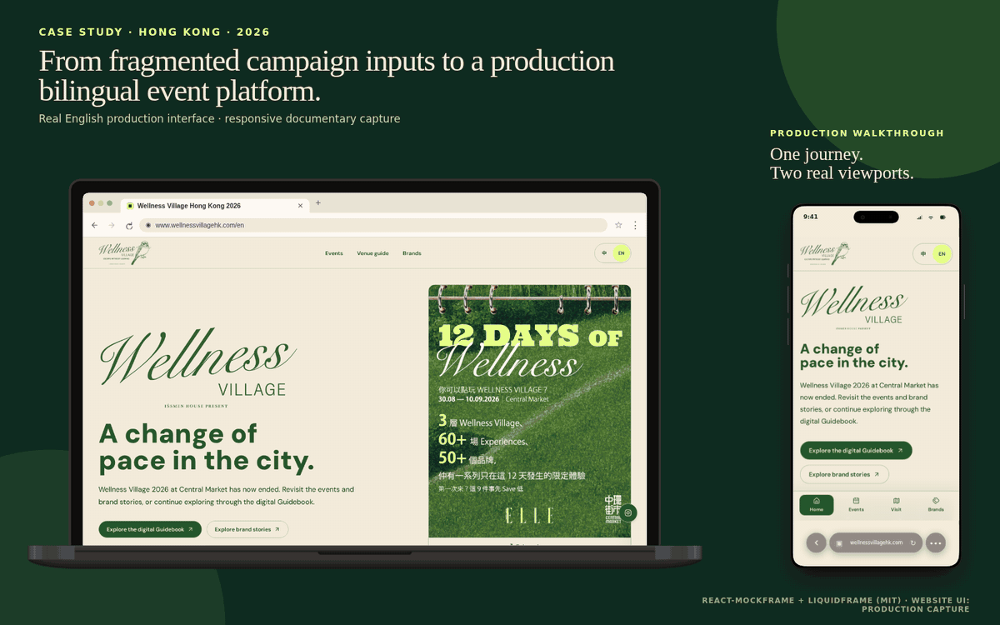

<!-- section:hero -->
# Wellness Village Event Website

[**English**](README.md) · [繁體中文](README.zh-Hant.md)



[View the static cover](docs/media/portfolio-hero.png) · [Download the H.264 walkthrough](docs/media/responsive-scroll-walkthrough.mp4)

I designed and built this bilingual website for Wellness Village, a 12-day event at Central Market in Hong Kong. It brought together an existing 184-page Guidebook, brand links, programme listings from The Ground and a simple contact workflow for the client.

I was the sole developer. My work covered the site structure, mobile and bilingual experience, content preparation, public research, full-stack development, Cloudflare setup and launch. The client supplied the campaign assets, Guidebook, design guide and factual approvals. I also used an Agent for research organisation, implementation drafts and checks, but I reviewed the work and made the product, privacy and release decisions.

> This is a cleaned-up portfolio copy, not the private production repository. It uses synthetic demo data and leaves out credentials, personal data, private messages and source assets that I do not have permission to redistribute. The code is available to read, but it is not released under an open-source licence. See [NOTICE.md](NOTICE.md) and [ASSET_POLICY.md](ASSET_POLICY.md).

[Visit the campaign site](https://www.wellnessvillagehk.com/) — the event URL may be retired later. The media and runnable demo in this repository are the long-term record.

[Browse the full case study](docs/case-study/README.md) · [Go straight to the code-and-test index](docs/case-study/10-evidence-index.md)

<!-- section:project-summary -->
## Project in one minute

| | |
| --- | --- |
| **Event** | Wellness Village at Central Market, presented by ELLE Hong Kong and IŚSMEN; 12 days across three floors, with 50+ brands and 30+ workshops and experiences reported by ELLE Hong Kong |
| **My role** | Sole developer, from the first reviewable MVP to launch and event support |
| **Timeline** | Home-server preview on 5 August; production URL shared on 20 August, before the 21 August internal target; event ran from 30 August to 10 September 2026 |
| **Languages** | English and Traditional Chinese with the same page structure |
| **Main stack** | Next.js, React, TypeScript, OpenNext, Cloudflare Workers, Queues, R2, Durable Objects, Turnstile and Google Sheets API |
| **Public version** | Runnable with synthetic content and no production credentials |

[ELLE Hong Kong's event introduction](https://www.elle.com.hk/life/wellness-village-elle-hong-kong-issmen) provides the public event background. The figures above describe the size of the event; they do not tell us how many people attended or what the website caused.

<!-- section:built -->
## What I built

### 1. Guidebook content that works on the web

The client supplied a 184-page print Guidebook and campaign artwork. I prepared the supplied files for the web, including removing print-production marks, then reviewed the Guidebook page by page and organised 48 two-page profiles under four themes.

The brand profiles are fixed editorial content from the Guidebook. They are not updated from The Ground or another live feed. For outbound links, the client confirmed all 48 Instagram destinations. I independently checked 29 official websites; the other 19 profiles were left without a website button rather than being linked to a guessed domain.

[Read how the Guidebook was handled](docs/case-study/02-guidebook-and-agent-workflow.md) · [Inspect the anonymised count and link-status tests](src/content/guidebook-audit.test.ts)

### 2. A programme connected to The Ground

Activity times and registration could change, so I did not copy them into a second hand-maintained schedule. The server reads Wellness Village listings from The Ground, checks the fields the website needs, converts the times to Hong Kong time and groups activities into Today, Upcoming and Past. Visitors can filter the programme on the Wellness Village site, then continue to The Ground to register.

The integration has limits on pages, response size and waiting time. If The Ground is temporarily unavailable, the site can use a recent in-memory copy; if no usable copy exists, it says the programme is unavailable and provides a direct route to The Ground.

[Read the programme-data walkthrough](docs/case-study/04-the-ground-event-interface.md) · [Inspect the adapter and tests](src/integrations/the-ground/)

### 3. Contact details sent to the client's Google Sheet

The client did not need a new CRM or application database for a small contact form. The website checks a minimal submission, uses Turnstile and rate limits to reduce abuse, then places accepted submissions on a Cloudflare Queue. A separate private Worker reads the Queue and writes new rows to the client's Google Sheet.

Google credentials stay in that private Worker, not in the browser or main website. Stable submission IDs and duplicate checks help retries settle on one row. A `202 Accepted` response means the Queue accepted a genuine submission; it does not mean Google Sheets finished writing the row at that exact moment.

[Read the Queue-to-Sheets walkthrough](docs/case-study/05-queue-to-sheets-interface.md) · [Inspect the consumer and tests](workers/contact-sheet-consumer/)

<!-- section:architecture -->
## How the pieces fit together



The site keeps three kinds of information separate:

- **Brand and Guidebook pages:** prepared from the client-supplied Guidebook and approved links.
- **Programme and registration:** times come from The Ground; registration returns to The Ground.
- **Contact details:** the form goes through Cloudflare Queue to a private Worker and then to the client's Sheet.

The Next.js application runs on Cloudflare Workers through OpenNext. R2 and Durable Objects support application caching and revalidation; they are not used to store contact submissions.

[Open the diagram source](docs/diagrams/system-overview.mmd) · [See the four main architecture decisions](docs/decisions/)

<!-- section:agent-use -->
## How I used an Agent during the build

Most of the client input arrived as a Guidebook, artwork, a design guide and messages rather than a finished product specification. I used an Agent to help list the available sources, organise candidate research, draft parts of the implementation, refactor code, write tests and check documentation.

I still reviewed every Guidebook page, decided which source to use for each type of information, checked public links, designed the visitor flow, followed up unclear client facts, set the privacy rules and approved each release. The first home-server MVP was a useful starting point for discussion, not a one-prompt version of the finished site.

[Read the working process](docs/agent-workflow/working-with-an-agent.md) · [See the reconstructed MVP brief](docs/agent-workflow/reconstructed-mvp-brief.md) · [Read the public Agent instructions](AGENTS.md)

<!-- section:timeline -->
## From the first preview to launch

| Date | What happened |
| --- | --- |
| **5 August** | The project direction and 21 August target were confirmed. I put a first reviewable MVP on my home server later that day, before the production domain existed. |
| **12–19 August** | I worked through the current Guidebook, supplied design material, programme integration, formal written Chinese, brand links and client UX feedback. |
| **19 August** | The production domain was registered. |
| **20 August** | I shared the working production URL, one day before the internal target. Smaller corrections and operational checks continued afterwards. |
| **30 August–10 September** | The event was open and the website was in use. |

[Read the fuller timeline](docs/case-study/delivery-timeline.md) · [View the timeline diagram](docs/diagrams/delivery-evolution.svg)

<!-- section:production -->
## What I observed after launch

| Recorded item | Result |
| --- | ---: |
| Cloudflare edge requests during the event window | 108,443 |
| Successful HTML page responses | 4,322 |
| Data delivered | 4.34 GB |
| Data served from cache | 78.5% |
| OpenNext Worker invocations | approximately 35,600 |
| Google Search clicks in the event-aligned Search Console period | 112 from 362 impressions |
| Cloudflare usage charges shown for the complete billing period | US$0.00 |
| Direct first-year domain registration | US$11.08 |

These numbers show that the production site handled real traffic and remained within the included Cloudflare usage shown for that billing period. They are not attendance, unique visitor, booking-conversion or ROI figures. The Cloudflare bill is account-level, and Search Console reports dates in Pacific Time, so the detailed notes keep those limits visible.

[Read the Cloudflare and cost notes](docs/case-study/07-production-economics-and-observability.md) · [Read the Search Console notes](docs/case-study/08-search-discoverability.md)

<!-- section:lessons -->
## What I would measure next time

The project has good records for delivery, code behaviour, traffic, cost and search discovery. It does not have a controlled usability study or a before-and-after conversion baseline, so I do not claim that the website increased attendance, bookings or satisfaction.

For another event, I would add a small round of task-based testing before launch, privacy-conscious counts for programme views and outbound booking links, and an independent accessibility or design review. That would make it easier to compare the visitor journey with the original Guidebook and booking platform without collecting unnecessary personal data.

[Read the lessons and full list of limitations](docs/case-study/09-lessons-and-limitations.md)

<!-- section:explore -->
## Explore the project

| If you want to see… | Start here |
| --- | --- |
| What I owned and how the project moved from brief to launch | [Context and role](docs/case-study/01-context-and-role.md) · [Delivery timeline](docs/case-study/delivery-timeline.md) |
| How a first-time visitor moves through the site | [Visitor journey](docs/case-study/03-visitor-journey.md) |
| How Guidebook content and Agent-assisted work were handled | [Guidebook and Agent workflow](docs/case-study/02-guidebook-and-agent-workflow.md) |
| How programme data moves from The Ground into the interface | [The Ground integration](docs/case-study/04-the-ground-event-interface.md) |
| How contact details reach Google Sheets | [Queue-to-Sheets integration](docs/case-study/05-queue-to-sheets-interface.md) |
| Why the site ran on Workers and what it cost | [Cloudflare delivery](docs/case-study/06-cloudflare-delivery.md) · [Production notes](docs/case-study/07-production-economics-and-observability.md) |
| Which public claim links to which code or test | [Code-and-test index](docs/case-study/10-evidence-index.md) |

<details>
<summary>Repository map</summary>

```text
src/app/                            English and Traditional Chinese routes
src/content/                        editorial content and public audit data
src/features/home/                  homepage and visitor guidance
src/features/programme/             programme dates, categories and filters
src/features/interest/              contact-form checks and Queue producer
src/integrations/the-ground/        server-side The Ground adapter
workers/contact-sheet-consumer/     private Queue consumer and Sheets adapter
fixtures/demo/                      synthetic events and brands
docs/case-study/                    product and technical walkthroughs
docs/agent-workflow/                Agent workflow, MVP brief and release checklist
docs/decisions/                     architecture decision records
docs/diagrams/                      SVG diagrams and Mermaid source
docs/evidence/                      cleaned-up timeline, traffic and search records
docs/media/                         portfolio images, GIFs and videos
```

</details>

<!-- section:run-locally -->
## Run the demo locally

The demo uses synthetic events and brands by default. It does not need production credentials or a live connection to The Ground, Google or Cloudflare.

```sh
npm install
npm run dev
```

Run the full local check with:

```sh
npm run check
```

Live integrations are separate opt-ins and stay off when their configuration is missing. For the Cloudflare build and preview commands, see [Cloudflare delivery](docs/case-study/06-cloudflare-delivery.md). For the contact consumer, see its [standalone guide](workers/contact-sheet-consumer/README.md).

<!-- section:publication -->
## About this public version

- The production repository, Guidebook master, licensed fonts, raw campaign files, credentials, private correspondence and visitor records are not included.
- The screenshots, GIFs and videos preserve the delivered interface in case the campaign URL is retired.
- The repository is source-available for portfolio review. No permission to copy, modify, redistribute or commercially deploy the original code is granted.

[Read the notice](NOTICE.md) · [Read the asset policy](ASSET_POLICY.md) · [Read the security notes](SECURITY.md)

<!-- section:contact -->
## Contact

If you would like to discuss a similar event, content or integration project, connect with me on [LinkedIn](https://www.linkedin.com/in/jackyng-tf/).
