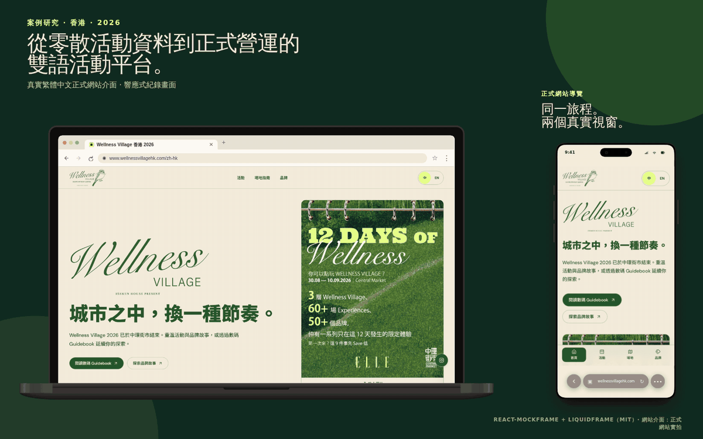

<!-- section:hero -->
# Wellness Village 活動網站

[English](README.md) · [**繁體中文**](README.zh-Hant.md)



[查看靜態封面](docs/media/portfolio-hero-zh-Hant.png) · [下載 H.264 導覽影片](docs/media/responsive-scroll-walkthrough-zh-Hant.mp4)

我為香港中環街市的 Wellness Village 設計及開發這個中英文活動網站。網站把一本既有的 184 頁 Guidebook、品牌連結、The Ground 的節目資料，以及客戶需要的聯絡流程整理到同一個瀏覽體驗。

我是本項目的唯一開發者，工作包括網站架構、手機及雙語體驗、內容整理、公開資料研究、全端開發、Cloudflare 設定及上線。我亦有使用 Agent 協助整理研究、草擬部分實作及進行檢查；所有產品、個人資料處理及發佈決定仍由我審閱。客戶則提供活動素材、Guidebook、設計指引及事實確認。

> 這是整理後的作品集版本，並非私人正式版本的儲存庫。當中只使用合成示範資料，不包括憑證、個人資料、私人訊息，以及我沒有權限再分發的原始素材。程式碼可供閱覽，但沒有以開放原始碼授權發佈。詳見 [NOTICE.md](NOTICE.md) 及[素材政策](ASSET_POLICY.md)。

[瀏覽活動網站](https://www.wellnessvillagehk.com/)——活動網址日後可能停止使用。本儲存庫內的圖片、影片及可執行示範會保留這個項目的紀錄。

[查看完整案例研究](docs/case-study/README.md) · [直接查看程式碼與測試索引](docs/case-study/10-evidence-index.md)

<!-- section:project-summary -->
## 一分鐘了解項目

| | |
| --- | --- |
| **活動** | 由 ELLE Hong Kong 與 IŚSMEN 呈獻、於中環街市舉行的 Wellness Village；ELLE Hong Kong 報道活動為期 12 日、橫跨三個樓層，集合超過 50 個品牌及 30 多項工作坊與體驗 |
| **我的角色** | 唯一開發者，由首個可供審閱的 MVP 負責至正式上線及活動期間支援 |
| **時間線** | 8 月 5 日提供家中伺服器預覽；8 月 20 日分享正式網址，早於 8 月 21 日內部目標；活動於 2026 年 8 月 30 日至 9 月 10 日舉行 |
| **語言** | 英文與繁體中文使用相同頁面架構 |
| **主要技術** | Next.js、React、TypeScript、OpenNext、Cloudflare Workers、Queues、R2、Durable Objects、Turnstile 及 Google Sheets API |
| **公開版本** | 使用合成內容即可執行，不需要正式環境憑證 |

[ELLE Hong Kong 的活動介紹](https://www.elle.com.hk/life/wellness-village-elle-hong-kong-issmen)提供公開活動背景。以上數字只用來交代活動規模，不能用來推斷實際入場人數或網站帶來的成效。

<!-- section:built -->
## 我完成的三個主要部分

### 1. 把 Guidebook 內容整理成網頁

客戶提供了一本 184 頁的印刷 Guidebook 及活動圖片。我先把提供的檔案整理成適合網頁使用的版本，包括移除印刷裁切標記，再逐頁檢查 Guidebook，將 48 個各佔兩頁的品牌專題分到四個主題之下。

品牌介紹是來自 Guidebook 的固定內容，不會由 The Ground 或其他即時資料來源更新。對外連結方面，客戶確認了全部 48 個 Instagram 連結；我另外核對了 29 個官方網站。其餘 19 個品牌沒有加入網站按鈕，以免放入未能確認的網址。

[了解 Guidebook 的處理方式](docs/case-study/02-guidebook-and-agent-workflow.md) · [查看匿名化數量及連結狀態測試](src/content/guidebook-audit.test.ts)

### 2. 把節目資料連接到 The Ground

活動時間及報名安排可能改動，所以我沒有在網站另外維護一份時間表。伺服器會讀取 The Ground 上屬於 Wellness Village 的活動資料，檢查網站需要的欄位，轉換成香港時間，再分成今日、即將舉行及已結束。訪客可以先在 Wellness Village 網站篩選活動，報名時再前往 The Ground。

整合會限制讀取頁數、回應大小及等待時間。如果 The Ground 暫時無法連線，網站可以使用近期保留在記憶體內的資料；如果沒有可用資料，頁面會顯示節目暫時無法載入，並提供 The Ground 的直接連結。

[了解節目資料如何處理](docs/case-study/04-the-ground-event-interface.md) · [查看 adapter 及測試](src/integrations/the-ground/)

### 3. 把聯絡資料送到客戶的 Google Sheet

這個簡單的聯絡表格不需要另建 CRM 或應用程式資料庫。網站會檢查最少所需的提交內容，透過 Turnstile 及速率限制減少濫用，再把接受的提交放入 Cloudflare Queue。另一個不公開的 Worker 會讀取 Queue，並將新資料列寫入客戶的 Google Sheet。

Google 憑證只存放在該私人 Worker，不會傳到瀏覽器或主要網站。穩定的提交識別碼及重複檢查有助避免重試時重複寫入。`202 Accepted` 只表示 Queue 已接受一個真實提交，並不代表 Google Sheets 在同一刻已完成寫入。

[了解 Queue-to-Sheets 流程](docs/case-study/05-queue-to-sheets-interface.md) · [查看 consumer 及測試](workers/contact-sheet-consumer/)

<!-- section:architecture -->
## 各部分如何連接



網站把三類資料分開處理：

- **品牌及 Guidebook 頁面：** 根據客戶提供的 Guidebook 及已確認連結整理。
- **節目及報名：** 活動時間以 The Ground 為準，報名亦返回 The Ground 完成。
- **聯絡資料：** 表格經 Cloudflare Queue 送到私人 Worker，再寫入客戶的 Sheet。

Next.js 應用程式透過 OpenNext 在 Cloudflare Workers 上執行。R2 及 Durable Objects 用於應用程式快取和重新驗證，不會儲存聯絡表格內容。

[查看圖表原始檔](docs/diagrams/system-overview.zh-Hant.mmd) · [查看四項主要架構決定](docs/decisions/)

<!-- section:agent-use -->
## 我在開發期間如何使用 Agent

客戶提供的主要是 Guidebook、圖片、設計指引及訊息，而不是一份完整的產品規格。我使用 Agent 協助列出現有資料、整理候選研究結果、草擬部分程式碼、重構、編寫測試及檢查文件。

我仍然逐頁檢查 Guidebook、決定每類資料應參考哪個來源、核對公開連結、設計訪客流程、向客戶確認不清楚的事實、訂立個人資料處理方式，以及審批每次發佈。首個家中伺服器 MVP 是用來開始討論的版本，並不是由一個 prompt 直接產生的完成品。

[閱讀工作流程](docs/agent-workflow/working-with-an-agent.md) · [查看重建版 MVP brief](docs/agent-workflow/reconstructed-mvp-brief.md) · [閱讀公開 Agent 指引](AGENTS.md)

<!-- section:timeline -->
## 由首個預覽到正式上線

| 日期 | 進度 |
| --- | --- |
| **8 月 5 日** | 項目方向及 8 月 21 日內部目標獲確認。我在同日稍後把首個可供審閱的 MVP 放到家中伺服器，當時正式網域尚未購買。 |
| **8 月 12–19 日** | 我陸續處理最新 Guidebook、客戶提供的設計資料、節目整合、書面中文、品牌連結及客戶的使用體驗回饋。 |
| **8 月 19 日** | 正式網域完成註冊。 |
| **8 月 20 日** | 我分享了可供使用的正式網址，比內部目標早一日。其後仍繼續處理小型修正及營運檢查。 |
| **8 月 30 日至 9 月 10 日** | 活動正式舉行，網站亦投入使用。 |

[閱讀完整時間線](docs/case-study/delivery-timeline.md) · [查看時間線圖表](docs/diagrams/delivery-evolution.zh-Hant.svg)

<!-- section:production -->
## 上線後記錄到的情況

| 記錄項目 | 結果 |
| --- | ---: |
| 活動時段的 Cloudflare 邊緣請求 | 108,443 |
| 成功回傳的 HTML 頁面 | 4,322 |
| 傳輸量 | 4.34 GB |
| 由快取提供的傳輸量 | 78.5% |
| OpenNext Worker 調用 | 約 35,600 |
| 與活動日期對齊的 Search Console 時段內，來自 Google 搜尋的點擊 | 112 次，來自 362 次曝光 |
| 完整帳單週期顯示的 Cloudflare 用量費 | US$0.00 |
| 首年網域註冊費 | US$11.08 |

這些數字顯示正式網站處理過真實流量，而該帳單週期顯示的 Cloudflare 用量仍在已包括額度內。它們不等於入場人數、獨立訪客、報名轉換或投資回報。Cloudflare 帳單屬帳戶層面，Search Console 日期亦以 Pacific Time 計算；詳細章節保留了這些限制。

[閱讀 Cloudflare 與成本紀錄](docs/case-study/07-production-economics-and-observability.md) · [閱讀 Search Console 紀錄](docs/case-study/08-search-discoverability.md)

<!-- section:lessons -->
## 下次我會增加哪些量度

目前紀錄可以說明交付時間、程式行為、流量、成本及搜尋曝光，但項目沒有進行受控使用者測試，亦沒有保留前後轉換基準。因此，我不會宣稱網站提高了入場、報名或滿意度。

如果再做同類活動，我會在上線前安排一輪簡短的任務測試，以不記錄個人資料的方式量度節目頁瀏覽及前往報名平台的次數，並請另一位設計或無障礙評審重新檢查主要流程。這樣便可以更實際地比較網站、原始 Guidebook 及報名平台的使用體驗。

[閱讀經驗及完整限制](docs/case-study/09-lessons-and-limitations.md)

<!-- section:explore -->
## 深入了解項目

| 如果你想了解…… | 建議由這裡開始 |
| --- | --- |
| 我負責的範圍，以及項目如何由 brief 推進至上線 | [背景與角色](docs/case-study/01-context-and-role.md) · [交付時間線](docs/case-study/delivery-timeline.md) |
| 首次到訪的使用者如何瀏覽網站 | [訪客流程](docs/case-study/03-visitor-journey.md) |
| Guidebook 內容及 Agent 輔助工作如何處理 | [Guidebook 與 Agent 工作方式](docs/case-study/02-guidebook-and-agent-workflow.md) |
| 節目資料如何由 The Ground 進入網站 | [The Ground 整合](docs/case-study/04-the-ground-event-interface.md) |
| 聯絡資料如何到達 Google Sheets | [Queue-to-Sheets 整合](docs/case-study/05-queue-to-sheets-interface.md) |
| 為何使用 Workers，以及實際成本 | [Cloudflare 交付](docs/case-study/06-cloudflare-delivery.md) · [正式環境紀錄](docs/case-study/07-production-economics-and-observability.md) |
| 公開陳述分別對應哪些程式碼或測試 | [程式碼與測試索引](docs/case-study/10-evidence-index.md) |

<details>
<summary>儲存庫結構</summary>

```text
src/app/                            英文及繁體中文 routes
src/content/                        編輯內容及公開審計資料
src/features/home/                  首頁及訪客導覽
src/features/programme/             節目日期、分類及篩選
src/features/interest/              聯絡表格檢查及 Queue producer
src/integrations/the-ground/        僅在伺服器執行的 The Ground adapter
workers/contact-sheet-consumer/     私人 Queue consumer 及 Sheets adapter
fixtures/demo/                      合成活動及品牌資料
docs/case-study/                    產品及技術說明
docs/agent-workflow/                Agent 工作方式、MVP brief 及發佈清單
docs/decisions/                     架構決定紀錄
docs/diagrams/                      SVG 圖表及 Mermaid 原始檔
docs/evidence/                      經整理的時間線、流量及搜尋紀錄
docs/media/                         作品集圖片、GIF 及影片
```

</details>

<!-- section:run-locally -->
## 在本機執行示範

示範版本預設使用合成活動及品牌資料，不需要正式環境憑證，亦不需要連接 The Ground、Google 或 Cloudflare。

```sh
npm install
npm run dev
```

執行完整本機檢查：

```sh
npm run check
```

即時整合需要另行啟用；缺少設定時會維持停用。Cloudflare build 及 preview 指令可參閱 [Cloudflare 交付](docs/case-study/06-cloudflare-delivery.md)。聯絡資料 consumer 則有一份[獨立說明](workers/contact-sheet-consumer/README.md)。

<!-- section:publication -->
## 關於這個公開版本

- 正式版本儲存庫、Guidebook 原稿、授權字體、活動原始檔案、憑證、私人通訊及訪客紀錄均不包括在內。
- 截圖、GIF 及影片會保留已交付的網站介面，以免活動網址日後停止使用便無法查看。
- 本儲存庫只供作品集閱覽。公開可見並不代表可以複製、修改、再分發或商業部署原創程式碼。

[閱讀法律聲明](NOTICE.md) · [閱讀素材政策](ASSET_POLICY.md) · [閱讀安全說明](SECURITY.md)

<!-- section:contact -->
## 聯絡方式

如想討論類似的活動網站、內容整理或系統整合項目，歡迎透過 [LinkedIn](https://www.linkedin.com/in/jackyng-tf/) 與我聯絡。
