<!-- section:hero -->
# Wellness Village 活動平台

[English](README.md) · [**繁體中文**](README.zh-Hant.md)


[查看適合減少動態效果的靜態封面](docs/media/portfolio-hero-zh-Hant.png) · [下載 H.264 導覽影片](docs/media/responsive-scroll-walkthrough-zh-Hant.mp4)

**一個以證據為先的雙語活動平台，將 184 頁 Guidebook、經核實的品牌研究、即時預約資料及個人資料保護要求，轉化為正式投入使用的訪客體驗。**

我是本項目的唯一開發者，負責產品方向、證據模型、雙語使用者體驗、全端實作、Cloudflare 交付及發佈作業。客戶提供活動素材、Guidebook、設計指引及事實審批；Agent 則協助加快研究整理、實作與驗證。產品判斷、客戶事實、個人資料處理決定及發佈權限始終由人負責。

> **作品集版本。** 這是經整理及刪除敏感資訊的案例研究與可執行參考實作，刻意與私人正式版本的儲存庫及歷史分開。當中不包含憑證、個人資料、私人交接資料，亦不包含不可再分發的原始素材。本儲存庫只屬**原始碼可供閱覽（source-available），並非開放原始碼**；並無授予複製、修改、再分發或商業部署原創程式碼的權利。詳見[法律聲明](NOTICE.md)及[素材政策](ASSET_POLICY.md)。

[瀏覽活動正式網站](https://www.wellnessvillagehk.com/)——這個限時活動網址日後可能停止使用。本儲存庫內的紀錄媒體與可執行示範才是可長期保存的紀錄。

[開啟案例研究索引](docs/case-study/README.md) · [在證據索引追查主要陳述](docs/case-study/10-evidence-index.md)

<!-- section:at-a-glance -->
## 項目概覽

| | |
| --- | --- |
| **背景** | 於香港中環街市舉行、設有雙語內容並有指定期限的 Wellness Village 活動 |
| **公開活動規模** | ELLE Hong Kong 報道活動一連 12 日、橫跨三個樓層，集合超過 50 個品牌及 30 多項工作坊與體驗 |
| **我的職責** | 唯一開發者：產品定位、資訊架構、證據規則、使用者體驗、素材整理、公開資料研究、全端實作、系統整合、Cloudflare 交付及發佈檢查 |
| **人與客戶掌握的權限** | 客戶確認、個人資料處理決定、事實審批及最終發佈決定 |
| **交付節奏** | 8 月 5 日提供首個家中伺服器審閱版 MVP；8 月 20 日分享正式網站，早於 8 月 21 日內部目標；活動於 8 月 30 日開始 |
| **完成的體驗** | 英文與繁體中文共用同一資訊架構，涵蓋活動導覽、節目、到訪、品牌及 Guidebook 旅程 |
| **核心技術** | Next.js、React、TypeScript、Zod、OpenNext、Cloudflare Workers、Queues、R2、Durable Objects、Turnstile 及 Google Sheets API |
| **正式環境證據** | 活動時段錄得 108,443 個邊緣請求、4,322 次 HTML 頁面瀏覽及 4.34 GB 傳輸量；成本與指標邊界詳列於下文 |
| **搜尋證據** | 經驗證的 Domain 資源在與 12 個活動日曆日期對齊的 PT 時段錄得 112 次網頁搜尋點擊、362 次曝光（CTR 30.9%；平均排名 3.5） |
| **作品集狀態** | 活動後整理的獨立版本；本機使用合成示範資料，無須正式環境憑證 |
| **再使用狀態** | 原始碼只供作品集閱覽；沒有軟件授權或再使用許可 |

<!-- section:event-context -->
## 這是具活動規模的正式交付，而非單純的宣傳頁面

[ELLE Hong Kong 的活動介紹](https://www.elle.com.hk/life/wellness-village-elle-hong-kong-issmen)記錄 Wellness Village 於 2026 年 8 月 30 日至 9 月 10 日在中環街市舉行，一連 12 日橫跨地下、一樓及二樓，集合超過 50 個精選品牌、30 多項工作坊與體驗，市集可免費入場。活動由 ELLE Hong Kong 與 IŚSMEN 呈獻。

這個公開規模說明為何內容權威、最新時間表、雙語導覽、個人資料保護及發佈營運同樣重要；但它本身並不證明入場人數、轉換、商業回報，亦不代表網站造成活動成果。[閱讀完整背景與職責邊界](docs/case-study/01-context-and-role.md)。

<!-- section:delivery-timeline -->
## 由 brief 到正式營運

8 月 5 日，項目群組確認由我負責網站，並以 8 月 21 日為內部上線目標。當時正式網域尚未購入，我在同日晚上先以家中伺服器部署首個可供審閱的 MVP，讓抽象要求變成可以實際操作及討論的產品，同時讓客戶繼續集中處理活動籌備。

8 月 12 日至 19 日期間，審閱循環逐步加入最新的 184 頁 Guidebook、客戶提供的設計資料、The Ground 活動資料擷取、書面中文與使用者體驗回饋、品牌資料核實及正式網域準備。網域於 8 月 19 日註冊；可供公眾使用的正式網站則於 8 月 20 日分享，比內部目標早一日。其後仍繼續處理較小修正及營運強化，直至活動在 8 月 30 日開幕。



同日完成的 MVP 是**可供審閱的垂直切片**，並不代表單一 prompt 已完成正式系統。[閱讀完整交付時間線](docs/case-study/delivery-timeline.md) · [查閱已移除敏感資料的證據邊界](docs/evidence/delivery-timeline/) · [查看英文圖表](docs/diagrams/delivery-evolution.svg)

<!-- section:choose-perspective -->
## 選擇閱讀角度

| 閱讀角度 | 你會了解 | 建議起點 |
| --- | --- | --- |
| **交付與職責** | 唯一開發者如何由含糊 brief 及臨時家中伺服器預覽，推進至按時公開上線及活動支援 | [由 brief 到正式營運](docs/case-study/delivery-timeline.md) |
| **訪客體驗** | 首次到訪的使用者如何由活動導覽，前往場次選擇、行前準備、場地支援及延伸探索 | [導覽式訪客旅程](docs/case-study/03-visitor-journey.md) |
| **客戶與營運** | 網站如何配合 The Ground 與 Google Sheets，同時不取代兩個營運系統各自的權責 | [The Ground 介面](docs/case-study/04-the-ground-event-interface.md) · [Queue-to-Sheets 介面](docs/case-study/05-queue-to-sheets-interface.md) |
| **AI 輔助交付** | 證據邊界、範圍明確的 Agent brief 及人工審核，如何把零散輸入轉化為經驗證的實作 | [以證據為先的 Agent 工作流程](docs/case-study/02-evidence-first-agent-workflow.md) |
| **正式環境與成本** | 活動時段流量、Cloudflare 帳單邊界、直接 domain 成本及搜尋證據實際能支持甚麼結論 | [正式環境成本與可觀測性](docs/case-study/07-production-economics-and-observability.md) · [搜尋可見性](docs/case-study/08-search-discoverability.md) |
| **技術證據** | 每項主要陳述如何對應至精選程式碼、測試、圖表及決策紀錄 | [證據索引](docs/case-study/10-evidence-index.md) |
| **批判性檢視** | 哪些結果已獲驗證、哪些只是正式環境觀察、哪些尚未量度，以及日後活動可如何補足 | [經驗、證據與限制](docs/case-study/09-lessons-and-limitations.md) |

<!-- section:problem -->
## 起始問題

項目開始時並沒有單一而完整的規格或產品資料庫。輸入包括 184 頁編輯性 Guidebook、活動素材、公開品牌資料、The Ground 的即時活動資料、場地指引、報名限制及個人資料保護要求；各項來源均有不同的擁有者、用途及更新頻率。

因此，產品需要同時處理四個互相關連的問題：

1. 區分經核實的事實、編輯文字、假設及尚未取得的資料；
2. 引導尚未了解活動或網站架構的訪客；
3. 讓使用者發現最新場次，同時由 The Ground 保留預約權威；以及
4. 把經同意的聯絡意向送往客戶原有的 Google Sheets 工作流程，而不向瀏覽器或網站 Worker 暴露 Google 憑證。

[閱讀背景、限制與職責](docs/case-study/01-context-and-role.md)

<!-- section:delivered-outcomes -->
## 三個已交付的實證故事

| 實證故事 | 完成的成果 | 查閱證據 |
| --- | --- | --- |
| **Guidebook → 48 個專題及經核實的目的地** | 經視覺審閱後確立四個主題支柱及 48 個各佔兩頁的專題。全部 48 個專題均有客戶確認的 Instagram 目的地；其中 29 個另有獨立核實的官方網站，其餘 19 個保留為沒有網站操作，而非加入推測連結。 | [了解案例研究](docs/case-study/02-evidence-first-agent-workflow.md) · [查閱決策](docs/decisions/004-guidebook-content-boundaries.md) · [查閱已移除身份資料的稽核紀錄](src/content/guidebook-audit.ts) · [查閱相關測試](src/content/guidebook-audit.test.ts) |
| **The Ground → 以日期為本的活動探索及標準預約** | 僅在伺服器執行並經個人資料篩選的整合，把精確活動階段與香港曆日分開處理，並維持可重現的探索結果。經核實的即時記錄會把報名交回標準 The Ground 頁面；預設合成示範則使用清楚標示的保留 `example.com` 目的地。 | [了解案例研究](docs/case-study/04-the-ground-event-interface.md) · [查閱決策](docs/decisions/001-the-ground-is-the-live-source.md) · [查閱實作與測試](src/features/programme/) |
| **聯絡表格 → Queue → 私人 Worker → Google Sheets** | 公開 route 驗證最小化資料合約；真實且未觸發 honeypot 的提交會送入 Queue，而非公開 consumer 則隔離 Google 憑證，以穩定提交識別碼去除重複資料，並把原始值加入客戶擁有的 Sheet。真實提交只會在等待 Queue 接受訊息後收到 `202 Accepted`；honeypot 誘餌則刻意收到相同 `202` 而不會加入 Queue。兩者均不代表 Sheet 已完成寫入。 | [了解案例研究](docs/case-study/05-queue-to-sheets-interface.md) · [查閱決策](docs/decisions/003-queue-before-google-sheets.md) · [查閱實作與測試](workers/contact-sheet-consumer/) |

<a id="evidence-boundaries"></a>
<!-- section:evidence-boundaries -->
## 證據可以支持甚麼，也不能支持甚麼

本案例把實作證明、正式環境觀察，以及未有量度的成果清楚分開。這種界線比堆砌更多表面數字更重要。

| 評估問題 | 現有證據 | 狀態 | 陳述邊界 |
| --- | --- | --- | --- |
| 項目有否按時間表交付可供審閱的產品？ | 帶時間紀錄的私人項目資料、刪除敏感內容後的時間線及網域紀錄 | **有證據支持** | 可支持 8 月 5 日預覽版、8 月 20 日正式網址及 8 月 21 日內部目標；不能量化 AI 帶來的生產力提升 |
| 雙語內容與 Guidebook 規則是否保持內部一致？ | 型別化 routes、匿名化 48 個 profile 審計及自動內容檢查 | **已在公開版本驗證** | 可確認結構與證據狀態，而毋須重新公開私人身份或原始文案 |
| 外部介面有否保留各系統權威，並在失敗時作出明確處理？ | Runtime schemas、香港時間日期測試、Queue／consumer 測試及架構決策 | **已在參考實作驗證** | 測試可驗證指定情況下的行為，但不能保證 The Ground、Google 或 Cloudflare 永久可用 |
| 正式網站有否處理真實活動時段工作量，並維持在已記錄的成本邊界內？ | Cloudflare 邊緣、runtime、帳單證據及可直接歸屬的網域發票 | **已在正式環境觀察** | Requests 並非人數；零 usage charge 亦不等於零總成本或項目專屬帳單 |
| 活動對齊時段內，網站能否透過 Google 被找到？ | 已驗證 Search Console property、sitemap 及匯總成效紀錄 | **已在正式環境觀察** | 搜尋點擊與索引狀態不能證明入場、報名或商業回報 |
| 網站有否改善理解程度、報名轉換或滿意度？ | 項目沒有收集受控基準或 task-based user study | **未有量度** | 因此不會作出 UX 因果或商業成效陳述 |

[閱讀證據解讀方式、日後量度方案及完整限制](docs/case-study/09-lessons-and-limitations.md) · [透過證據索引追查個別陳述](docs/case-study/10-evidence-index.md)

<!-- section:system-overview -->
## 系統概覽


[查看系統概覽 SVG](docs/diagrams/system-overview.zh-Hant.svg) · [查閱 Mermaid 原始檔](docs/diagrams/system-overview.zh-Hant.mmd)

整個體驗把三條證據路徑連接起來，同時不混淆各自的權威：經整理的 Guidebook 內容支援探索；The Ground 擁有即時活動及預約紀錄；經同意的聯絡意向則以非同步方式通過私人憑證邊界。OpenNext 在 Cloudflare Workers 上執行 Next.js 應用程式，而 R2 與 Durable Object 用於應用程式快取及 revalidation，並非用作潛在客戶資料儲存。

<!-- section:production-evidence -->
## 正式環境證據：工作量與成本控制

經授權的唯讀 Cloudflare 分析保留了一個界限明確的活動時段，而非只展示累積總數：

| 觀察層 | 活動時段結果 | 正確解讀 |
| --- | ---: | --- |
| 邊緣請求 | 108,443 | 包括文件、素材、爬蟲及威脅，並非訪客數目 |
| HTML 頁面瀏覽 | 4,322 | 成功回傳的 HTML 回應，並非獨立使用者 |
| 回應傳輸量 | 4.34 GB | 經邊緣網絡傳送的流量 |
| 經快取傳送的位元組 | 78.5% | 大部分傳輸量由快取提供 |
| Worker 調用 | 約 35,600 | 到達 OpenNext runtime 的請求；adaptive 數據可能經抽樣 |

完整的 **2026 年 8 月 12 日至 9 月 11 日 Cloudflare 帳戶帳單週期**顯示**用量費為 US$0.00**，畫面所列用量全部在已包括的額度內。這只是帳戶層面的超額用量結果，並不代表項目或整個帳戶零成本：Workers Paid 當時有效，帳戶亦可能包含其他服務，而工程人力及第三方系統並不在該帳單畫面內。可直接歸屬本項目的 domain 註冊費為 **Porkbun 一年 US$11.08**；本案例不宣稱續期價格。

[閱讀正式環境成本章節](docs/case-study/07-production-economics-and-observability.md) · [查閱活動時段彙總紀錄](docs/evidence/production-metrics/event-window-aggregates.json) · [查閱帳單與 domain 紀錄](docs/evidence/production-metrics/billing-and-domain-summary.json) · [查看量度邊界圖](docs/diagrams/production-measurement-boundaries.zh-Hant.svg)

<!-- section:search-discoverability -->
## 搜尋可見性：已驗證結果，並清楚界定解讀範圍

2026 年 9 月 18 日的唯讀擷取確認正式網站提供 `robots.txt`，允許公開 routes、排除 `/api/` 並指向 sitemap。Sitemap 共列出 12 個語系 URL，即英文與繁體中文各六條 routes，並包含 `en`、`zh-HK` 及 `x-default` alternates。

經授權的 Chrome 工作階段亦顯示原有而且已驗證的 Google Search Console Domain 資源。在 **Search Console 以 Pacific Time 計算的 2026 年 8 月 30 日至 9 月 10 日（首尾兩日均包括）**，網頁搜尋錄得 **112 次點擊及 362 次曝光**，畫面顯示 **CTR 30.9%** 及**平均排名 3.5**。這組日期與香港活動的 12 個日曆日期對齊，但並非精確的香港時間小時窗口。

已提交的 sitemap 在 9 月 14 日最後一次成功讀取，共列出 12 個 URL。同日 Google 以 sitemap 為範圍的索引快照顯示**已索引 6 個、未索引 6 個**。Core Web Vitals 的 90 日實際使用者資料不足，因此本作品集不會宣稱真實使用者效能分數。

[閱讀搜尋可見性章節](docs/case-study/08-search-discoverability.md) · [查閱已移除敏感資料的 Search Console 紀錄](docs/evidence/search-discoverability/search-console-summary.json) · [查閱保留的 endpoint snapshots](docs/evidence/search-discoverability/)

<!-- section:visitor-perspective -->
## 訪客角度：一條連貫旅程

介面先提供活動導覽及下一步行動，而非要求訪客先理解內部內容架構。訪客可以：

1. 了解 Wellness Village；
2. 尋找活動並確認是否需要預約；
3. 出發前查看準備指引；
4. 查找場地、到達須知、地圖及文字替代內容；以及
5. 繼續探索品牌故事與數碼 Guidebook。

穩定的雙語 anchors、持續可用的流動裝置導覽、清晰的外部交接，以及誠實的空白或無法使用狀態，讓訪客無須依賴另一份虛構時間表也能完成旅程。

[查看訪客旅程 SVG](docs/diagrams/visitor-journey.zh-Hant.svg) · [查閱 Mermaid 原始檔](docs/diagrams/visitor-journey.zh-Hant.mmd)

<!-- section:client-operations-perspective -->
## 客戶與營運角度：改善系統交接

**在經核實的即時模式下，The Ground 保留營運權威。** 網站補充活動導覽、分類及以日期為本的探索，再把每項經核實的即時預約操作導向供應商的標準頁面。合成示範操作只會前往保留的 `example.com` 目的地，並清楚標示為示例。如無法取得最新即時資料，介面只會使用仍然有效的 warm snapshot，或顯示誠實的無法使用狀態及刻意提供的平台直接連結。

[查看活動介面 SVG](docs/diagrams/the-ground-event-interface.zh-Hant.svg) · [查閱 Mermaid 原始檔](docs/diagrams/the-ground-event-interface.zh-Hant.mmd)

**Google Sheets 保留為客戶擁有的營運目的地。** 網站不會為這個範圍有限的流程另設通用資料庫或 CRM。Cloudflare Queue 把訪客回應與 Google Sheets 的延遲分開，而私人單一寫入 consumer 則負責憑證、受控 retry 及 deduplication。

[查看 Queue-to-Sheets sequence SVG](docs/diagrams/queue-to-sheets-sequence.zh-Hant.svg) · [查閱 Mermaid 原始檔](docs/diagrams/queue-to-sheets-sequence.zh-Hant.mmd)

<!-- section:ai-delivery-perspective -->
## AI 輔助交付角度：在證據系統內運用協助

Agent 加快工作，但不擁有產品判斷權。

| 由人負責 | Agent 協助 | 驗收證據 |
| --- | --- | --- |
| 產品方向、資料來源權威、使用者體驗、架構、個人資料邊界及發佈批准 | 資料來源盤點、候選項目擷取、研究整理、實作草稿、重構、測試產生及文件整理 | 型別化合約、資料來源稽核、自動化測試、瀏覽器與無障礙品質檢查、正式環境 build 及唯讀發佈檢查 |

公開工作流程清楚列明：**Inventory → Bound claims → Model content → Brief vertical slice → Harden interfaces → Verify outcomes → Curate public evidence。** MVP brief 明確標示為「重建、經編輯及移除敏感資料」（reconstructed, edited and sanitised），因為原項目經歷研究、客戶決定及實作才逐步形成；它並非逐字保存的首個 prompt。

[閱讀完整工作流程](docs/agent-workflow/evidence-first-workflow.md) · [查閱重建版 MVP brief](docs/agent-workflow/reconstructed-mvp-brief.md) · [閱讀公開 Agent 規則](AGENTS.md)

[查看 Guidebook 證據流程 SVG](docs/diagrams/guidebook-content-pipeline.zh-Hant.svg) · [查閱 Mermaid 原始檔](docs/diagrams/guidebook-content-pipeline.zh-Hant.mmd)

<!-- section:decisions -->
## 主要決策與取捨

| 決策 | 原因 | 刻意接受的取捨 |
| --- | --- | --- |
| [由 The Ground 擁有即時時間表及預約權威](docs/decisions/001-the-ground-is-the-live-source.md) | 避免兩份互相衝突的營運紀錄，同時讓網站改善探索體驗 | 範圍有限的公開整合需要明確限制；無法取得最新資料時，必須提供誠實 fallback |
| [在 Cloudflare Workers 上使用 OpenNext](docs/decisions/002-workers-not-static-pages.md) | Server rendering、API routes、僅在伺服器執行的整合、Queues 及 revalidation 均需要 Worker runtime | 交付設定比靜態輸出更複雜 |
| [先進入 Queue，再寫入 Google Sheets](docs/decisions/003-queue-before-google-sheets.md) | 隔離 Google 憑證，並承受目的地延遲或短暫故障 | 訪客確認屬非同步；監察及 dead-letter 復原仍是營運責任 |
| [Guidebook 陳述維持編輯性質](docs/decisions/004-guidebook-content-boundaries.md) | 支援結構化雙語探索，同時不把印刷內容收錄誤當成即時參與或供應情況 | 每項營運陳述均須另有最新證據 |

<!-- section:capability-evidence -->
## 能力與證據對照表

| 能力 | 職責與交付證據 | 查閱位置 |
| --- | --- | --- |
| **端到端交付** | 先以同日家中伺服器垂直切片開始審閱，再獨立完成證據整理、客戶回饋、網域轉換、正式發佈及活動支援 | [交付時間線](docs/case-study/delivery-timeline.md) · [已移除敏感資料的時序紀錄](docs/evidence/delivery-timeline/) |
| **產品策略** | 以資料來源權威、訪客任務、客戶工作流程及合乎比例的公開版本界定產品 | [背景與職責](docs/case-study/01-context-and-role.md) · [案例研究索引](docs/case-study/README.md) |
| **使用者體驗與無障礙設計** | 設計共用的雙語流動優先路徑，加入穩定 anchors、文字替代內容、鍵盤操作及誠實故障狀態 | [訪客旅程](docs/case-study/03-visitor-journey.md) · [導覽首頁實作與測試](src/features/home/) |
| **Agent orchestration** | 定義證據層級、範圍明確的 brief、審核循環及由人掌握的發佈權限 | [Agent 工作流程](docs/agent-workflow/evidence-first-workflow.md) · [公開 Agent 規則](AGENTS.md) · [重建版 brief](docs/agent-workflow/reconstructed-mvp-brief.md) |
| **TypeScript 與 Next.js** | 把證據轉換成型別化雙語內容及 App Router 體驗 | [應用程式 routes 與測試](src/app/) · [型別化內容與測試](src/content/) |
| **API 與資料建模** | 建立有明確限制的 runtime schemas、經個人資料篩選的供應商合約、HKT 日期邏輯及可重現分類 | [The Ground 整合與測試](src/integrations/the-ground/) · [節目資料建模與測試](src/features/programme/) · [證據索引](docs/case-study/10-evidence-index.md) |
| **Cloudflare 交付** | 把 full-stack Next.js runtime 封裝至 Workers，配合 R2 快取、Durable Object revalidation 及 dry-run 檢查 | [交付章節](docs/case-study/06-cloudflare-delivery.md) · [OpenNext 設定](open-next.config.ts) · [Wrangler 設定](wrangler.jsonc) |
| **可觀測性與成本控制** | 分開邊緣流量、runtime 用量、已驗證搜尋結果、帳單週期超額費、直接 domain 支出及公開價目表，不把請求當作訪客，亦不把共享帳戶收費當作項目成本 | [正式環境成本章節](docs/case-study/07-production-economics-and-observability.md) · [已移除敏感資料的證據](docs/evidence/) · [量度邊界圖](docs/diagrams/production-measurement-boundaries.zh-Hant.svg) |
| **個人資料保護** | 為個人資料處理加設閘門、隔離 Google 憑證，並把 payload 排除於應用程式日誌之外 | [Queue-to-Sheets 章節](docs/case-study/05-queue-to-sheets-interface.md) · [公開 producer 與測試](src/features/interest/) · [私人 consumer 與測試](workers/contact-sheet-consumer/) |
| **可靠性** | 使用設有明確界限的資料擷取、runtime validation、明確 fallback、穩定 ID、retry、deduplication 及發佈證據 | [發佈檢查清單](docs/agent-workflow/release-checklist.md) · [整合測試](src/integrations/the-ground/) · [consumer 測試](workers/contact-sheet-consumer/) |
| **雙語產品交付** | 讓英文與繁體中文 routes、紀錄媒體及公開文件維持一致的結構 | [應用程式 routes 與測試](src/app/) · [訪客旅程](docs/case-study/03-visitor-journey.md) · [媒體文件](docs/media/README.md) |

<!-- section:repository-map -->
## 儲存庫導覽

```text
src/app/                            雙語 routes 及公開 API 邊界
src/content/                        型別化編輯內容及證據狀態
src/features/home/                  導覽式訪客旅程
src/features/programme/             日期、分類、排序及篩選邏輯
src/features/interest/              表格驗證及 Queue producer
src/integrations/the-ground/        有明確限制且僅在伺服器執行的活動 adapter
workers/contact-sheet-consumer/     私人 Queue consumer 及 Sheets adapter
fixtures/demo/                      只包含合成活動與品牌資料
docs/case-study/                    以證據支持的產品、交付及技術章節
docs/agent-workflow/                工作流程、重建版 brief 及發佈閘門
docs/decisions/                     架構決策紀錄
docs/diagrams/                      已渲染 SVG 及可查閱 Mermaid 原始檔
docs/evidence/                      已移除敏感資料的交付、正式環境及搜尋紀錄
docs/media/                         經批准的作品集紀錄媒體
```

透過[證據索引](docs/case-study/10-evidence-index.md)，可由公開陳述追查至其實作、測試及限制該陳述的決策。

<!-- section:run-locally -->
## 在本機執行

參考應用程式預設使用合成資料，無須正式環境憑證、即時供應商或 `.env.local` 檔案。

**合成本機模式無須任何正式環境資源。** The Ground 存取及原生聯絡意向收集均維持停用，系統只使用合成 fixtures。

```sh
npm install
npm run dev
```

執行完整本機應用程式檢查：

```sh
npm run check
```

如要在不部署的情況下建立及檢查中立的 Cloudflare Worker 設定，可執行：

```sh
npm run cf:typegen
npm run cf:typegen:check
npm run cf:build
npm run cf:dry-run
npm run cf:preview
```

`cf:dry-run` 每次均會先重新 build，再執行 `wrangler deploy --dry-run`；它不會 upload 或 deploy。`cf:preview` 會把 `wrangler.preview.jsonc` 同時交給受支援的 OpenNext build 及 OpenNext preview 指令，明確採用 direct revalidation queue，並沿用 preview 的本機預設值而不加入 `--remote`。一般 build 則保留 R2 incremental cache 與 Durable Object revalidation。網站設定不包含任何 Google 憑證或 Sheet secret。

真正部署屬日後須由擁有者另行批准的工作。部署前必須先準備 R2 cache bucket、revalidation Durable Object migration、聯絡 Queue／consumer／dead-letter Queue、互不相同的 rate-limit namespaces，以及 [Cloudflare 交付章節](docs/case-study/06-cloudflare-delivery.md)所列的已批准 runtime 設定。

Cloudflare 目前建議新的 Next.js 項目採用 vinext。本作品集保留 OpenNext，是為了重現有證據支持的既有交付架構，並非對所有新項目的概括建議。Cloudflare Pages 只屬過往考慮的靜態替代方案，並非已交付的 runtime。

如要獨立檢查預設停用的聯絡資料 pipeline，可執行：

```sh
npm run test -- src/features/interest src/app/api/interest
npm run contact-consumer:typegen
npm run contact-consumer:typegen:check
npm run contact-consumer:test
npm run contact-consumer:typecheck
npm run contact-consumer:dry-run
```

以上指令只會使用合成的 `example.com` 值及本機 doubles，不會呼叫真實 Cloudflare、Turnstile 或 Google 服務。獨立的 [consumer 指南](workers/contact-sheet-consumer/README.md)說明敏感資料邊界及單一 writer 的取捨。

即時 The Ground 存取及原生聯絡意向收集均為分開而明確的 opt-in。敏感值保留在版本控制之外；如缺少選用設定，系統會 fail closed，而不會改變示範模式的預設行為。

選用的即時活動目錄只會在伺服器讀取 `THE_GROUND_LIVE_ENABLED` 及 `THE_GROUND_ORGANIZATION_ID`。只有在獲授權使用正整數機構識別碼作測試時，才應複製 [`.env.example`](.env.example)，而且不得提交已填寫的值。若要求啟用即時模式但識別碼缺漏或無效，設定會直接失敗，不會暗中切換至示範記錄。

<!-- section:reliability-privacy-accessibility -->
## 可靠性、個人資料保護與無障礙設計

| 範疇 | 有證據支持的控制措施 |
| --- | --- |
| **可靠性** | 上游分頁、時間及 byte 大小均設明確上限；runtime schemas；清楚區分 warm snapshot 與無法使用狀態；Queue retry、deduplication 及 dead-letter 處理；分階段 build 與發佈檢查 |
| **個人資料保護** | 讀取 request body 前先檢查功能與設定；使用嚴格而最小化的 payload；伺服器端 Turnstile；Google 憑證只存在於私人 consumer；應用程式日誌不包含個人欄位；以 `RAW` 寫入 Sheet |
| **無障礙設計** | 共用雙語架構；語意化 headings 與 landmarks；鍵盤操作；清楚可見的 focus；touch target 及 overflow 檢查；地圖文字替代內容；減少動態效果的靜態媒體；瀏覽器與自動化無障礙品質檢查 |

[檢閱安全邊界](SECURITY.md) · [查閱公開發佈檢查清單](docs/agent-workflow/release-checklist.md) · [閱讀經驗與限制](docs/case-study/09-lessons-and-limitations.md)

<!-- section:limitations -->
## 刻意排除的內容與限制

- 活動正式網址有指定使用期限，日後可能停止服務；儲存庫媒體與使用合成資料的可執行示範才是可長期保存的紀錄。
- The Ground feed 是範圍有限的公開整合；本儲存庫並無記載長期合作存取或可用性保證。
- 記憶體內的 warm snapshot 只能應付短暫上游中斷，並非持久快取或可靠性承諾。
- Queue delivery 及 deduplication 可減少一般 retry 造成的重複資料，但不構成分散式 transaction 保證。資料保留、撤回及 dead-letter 復原仍由人負責營運。
- Google Sheets 適合這個範圍有限的客戶工作流程，但並非通用 transactional datastore。
- 邊緣請求、頁面瀏覽及 Worker 調用量度不同層次，不能當作訪客或入場人數。Cloudflare 帳單紀錄屬帳戶層面；Porkbun 註冊費才是可直接歸屬項目的成本。
- Search Console 的成效日期採用 PT。8 月 30 日至 9 月 10 日的選擇與活動日曆日期對齊，但並非精確的香港時間小時窗口；12 個已提交 URL 中有 6 個已索引，只是 9 月 14 日的快照，並非永久索引保證。
- Search Console 的流動裝置及桌面版 Core Web Vitals 均缺乏足夠的 90 日實際使用者資料，因此不會宣稱真實使用者效能結果。
- 不會宣稱任何未經量度的商業成果、交付速度提升或長期可靠性結果。
- 原始 Guidebook PDF 與頁面封存、客戶字體、活動原始素材、正式環境識別碼、憑證、個人資料、私人通訊及原始 Agent transcripts 均不包括在內。
- 本儲存庫只供作品集閱覽，並刻意不附軟件授權。公開可見並不授予複製、修改、再分發或商業部署原創程式碼的權利。

另請參閱[法律聲明](NOTICE.md)、[素材政策](ASSET_POLICY.md)、[安全政策](SECURITY.md)及[完整限制章節](docs/case-study/09-lessons-and-limitations.md)。

<!-- section:contact -->
## 聯絡方式

如需把零散來源資料、即時營運數據及現實限制轉化為可靠的產品體驗，歡迎透過 [LinkedIn](https://www.linkedin.com/in/jackyng-tf/) 與我聯絡。
