# How I worked with an Agent

[**English**](working-with-an-agent.md) · [繁體中文](working-with-an-agent.zh-Hant.md)

## Why the Agent needed context

Generating a page was not the difficult part. The project mixed a print Guidebook, public brand pages, changing activity listings, venue material and client decisions. Before asking an Agent to write anything, I needed to know which source covered each part of the website.

The Agent helped with repetitive and exploratory work: listing material, extracting candidates, organising research, drafting code, refactoring, writing tests and checking documentation. I reviewed the results and kept control of product decisions, client facts, privacy, architecture and release.

## The routine I used

**List the sources → define what each one covers → structure the content → build a small first slice → strengthen the integrations → check the result → prepare a public copy**

If a detail was missing, I left it missing, pending or unavailable instead of asking the Agent to complete it from context.

[View the Mermaid source](../diagrams/evidence-first-agent-workflow.mmd).

## 1. List the source material

For each source, I recorded:

- what it contained and who supplied or maintained it;
- whether it was editorial material, current operational data, a legal requirement or a technical record;
- whether it could change during the event; and
- whether it could be republished in a public portfolio.

For this project, that meant separating the 184-page Guidebook, venue material, public brand pages, The Ground listings and privacy requirements before turning any of them into website copy. See [context and my role](../case-study/01-context-and-role.md).

## 2. Decide what each source covers

| Source | Used for | Not used for |
| --- | --- | --- |
| Guidebook | Brand profiles, campaign story, four themes and page ranges | Current session status, booths, sponsorship or booking availability |
| The Ground | Activity times, prices, public availability and registration links | Brand stories, venue operations or participation outside its listings |
| Approved venue and campaign material | Address, visitor guidance, map and visual direction | Details that were not supplied or confirmed |
| First-party brand pages | Checking an official destination | Proving participation in the event |

This is why the Guidebook remained the basis for fixed brand content while programme times and registration came from The Ground. See [ADR 001](../decisions/001-the-ground-is-the-live-source.md) and [ADR 004](../decisions/004-guidebook-content-boundaries.md).

## 3. Turn checked material into structured content

I represented the reviewed material as typed content, including its publication state. Brand profiles, activities, registration status, venue guidance and bilingual interface text remained separate rather than being placed in one general content object.

In the Guidebook work, visual review found four themes and 48 two-page profiles. The client confirmed 48 Instagram links. I checked 29 official websites, while 19 profiles kept no website action. See [the Guidebook and Agent chapter](../case-study/02-guidebook-and-agent-workflow.md) and [Guidebook diagram](../diagrams/guidebook-content-pipeline.svg).

## 4. Ask for a small first slice

The reconstructed example brief covers:

- who the website was for and what they needed to do;
- which source to use for each type of information;
- the required pages and bilingual behaviour;
- features and data the first version should not include;
- privacy and secret-handling requirements; and
- checks that could be seen or tested.

The goal was a small working version that the client could discuss, not a finished production system. Questions that still needed a client decision stayed in a separate list. The [reconstructed MVP brief](reconstructed-mvp-brief.md) shows this scope but is not the original prompt.

## 5. Strengthen the external integrations

For every external service, I asked four practical questions:

1. What does the website accept?
2. What limits and checks are applied?
3. What is stored or forwarded?
4. What does the visitor see if the service fails?

For The Ground, the adapter limits pagination, gives each upstream request an eight-second timeout, rejects responses above 2 MiB, validates the response at runtime, converts times to HKT and keeps a five-minute in-memory copy. See [The Ground integration](../case-study/04-the-ground-event-interface.md).

For the contact form, the public Worker checks configuration, consent, Turnstile, rate limits, body size and schema before placing a genuine submission on the Queue. A separate Worker owns the Google credentials, 14-field internal format, retries, duplicate checks and dead-letter handling. Honeypot submissions receive the same public response but are not queued. See [Queue-to-Sheets](../case-study/05-queue-to-sheets-interface.md).

## 6. Check each kind of result in the right way

Different checks answer different questions. Content tests catch count or mapping errors. A build shows that the application compiles. Browser checks cover visible behaviour. A production smoke check shows what responded at that time.

My release sequence was: inspect → test → build → dry run → preview → deploy → read-only smoke checks. I recorded what ran and did not turn a passing technical check into a claim about conversion, productivity or long-term uptime.

The delivered application ran through OpenNext on Cloudflare Workers, with R2 used for incremental caching and a Durable Object used for revalidation. Contact submissions followed the separate Queue path. See [Cloudflare delivery](../case-study/06-cloudflare-delivery.md).

## 7. Prepare a separate public repository

I did not publish the private repository or its history. This portfolio copy contains selected implementation, synthetic fixtures, approved screenshots and videos, short decision notes, known limits and commands that can be run without production secrets.

It leaves out credentials, production identifiers, personal data, private messages, raw Agent transcripts and source material that cannot be redistributed. The [implementation map](../case-study/10-evidence-index.md) and [release checklist](release-checklist.md) help keep that separation clear.

## One rule I kept throughout

I treated Agent output as a draft. Before using it, I checked it against the source, a client decision or a testable requirement. If the source changed, I updated the content, code, tests and documentation together.
