# 我如何與 Agent 協作

[English](working-with-an-agent.md) · [**繁體中文**](working-with-an-agent.zh-Hant.md)

## 為何 Agent 需要足夠脈絡

產生一個頁面並不是最難的部分。項目同時涉及印刷 Guidebook、品牌公開頁面、會改動的節目列表、場地資料及客戶決定。在叫 Agent 寫任何內容前，我先要知道網站每一部分應該由哪個來源支持。

Agent 協助重複及探索工作：列出資料、擷取候選項目、整理研究、草擬程式碼、重構、寫測試及檢查文件。我會審閱結果，產品決定、客戶事實、私隱、架構及 release 仍由我負責。

## 使用的基本流程

**列出來源 → 界定各來源用途 → 結構化內容 → 建立小型第一版 → 加強整合 → 檢查結果 → 準備獨立公開版本**

資料缺漏時，我會把它標示為缺漏、待確認或暫時無法提供，而不是叫 Agent 按上下文補完。

[查看 Mermaid 原始檔](../diagrams/evidence-first-agent-workflow.zh-Hant.mmd)。

## 1. 列出資料來源

每個來源都記錄：

- 包含甚麼，以及由誰提供或維護；
- 屬於編輯內容、即時營運資料、法律要求或技術紀錄；
- 活動期間是否可能改變；以及
- 是否可以在公開作品集重新發佈。

本項目先把 184 頁 Guidebook、場地資料、品牌公開頁面、The Ground listings 及私隱要求分開，再把內容放到網站。[背景與角色](../case-study/01-context-and-role.zh-Hant.md)有較完整說明。

## 2. 決定每個來源負責甚麼

| 來源 | 用途 | 不用來判斷 |
| --- | --- | --- |
| Guidebook | 品牌介紹、活動故事、四個主題及頁碼 | 即時節目、攤位、贊助或報名狀態 |
| The Ground | 活動時間、價格、公開名額及報名連結 | 品牌故事、場地營運或列表以外的參與情況 |
| 已批准場地及活動資料 | 地址、訪客指引、地圖及視覺方向 | 未提供或未確認細節 |
| 品牌第一方頁面 | 核對官方目的地 | 證明品牌參與活動 |

因此，固定品牌內容以 Guidebook 為準；節目時間及報名則來自 The Ground。詳見 [ADR 001](../decisions/001-the-ground-is-the-live-source.zh-Hant.md)及 [ADR 004](../decisions/004-guidebook-content-boundaries.zh-Hant.md)。

## 3. 把已核對資料轉成結構化內容

我用 typed content 表示已審閱資料及發佈狀態。品牌介紹、活動、報名狀態、場地指引及雙語介面文字分開存放，而不是放入一個通用 content object。

Guidebook 視覺檢查找出四個主題及 48 個兩頁專題。客戶確認 48 個 Instagram 連結；我核對 29 個官方網站，其餘 19 個不顯示網站按鈕。詳見 [Guidebook 與 Agent 章節](../case-study/02-guidebook-and-agent-workflow.zh-Hant.md)及 [Guidebook 圖表](../diagrams/guidebook-content-pipeline.zh-Hant.svg)。

## 4. 先要求一個小型 vertical slice

重建版 brief 示例涵蓋：

- 網站為誰而設及使用者要完成甚麼；
- 各類資料應使用哪個來源；
- 必需頁面及雙語行為；
- 第一版不應包括的功能及資料；
- 私隱與 secret handling 要求；以及
- 可觀察或測試的完成條件。

目標是讓客戶可以討論的小型可運作版本，不是一次完成 production system。仍需客戶決定的問題另行列出。[重建版 MVP brief](reconstructed-mvp-brief.zh-Hant.md)展示這個 scope，但不是原始 prompt。

## 5. 加強外部整合

每個外部服務都回答四個實際問題：

1. 網站接受甚麼？
2. 有哪些上限及檢查？
3. 哪些資料會儲存或轉送？
4. 服務失敗時，訪客會看見甚麼？

The Ground adapter 會限制 pagination、為每個上游請求設定八秒逾時、拒絕超過 2 MiB 的回應、在 runtime 驗證資料、轉換成 HKT，並保留五分鐘記憶體副本。詳見 [The Ground 整合](../case-study/04-the-ground-event-interface.zh-Hant.md)。

聯絡表格方面，公開 Worker 在把真實提交放入 Queue 前，會檢查設定、consent、Turnstile、rate limits、body size 及 schema。另一個 Worker 持有 Google 憑證、14 欄內部格式、retry、duplicate check 及 dead-letter handling。honeypot 收到相同公開回應但不入 Queue。詳見 [Queue-to-Sheets](../case-study/05-queue-to-sheets-interface.zh-Hant.md)。

## 6. 用合適方法檢查不同結果

不同檢查回答不同問題。content tests 可發現數量或 mapping 錯誤；build 證明應用程式可以 compile；browser checks 檢查可見行為；production smoke check 只證明當時有回應。

我的 release sequence 是：inspect → test → build → dry run → preview → deploy → read-only smoke checks。我記錄實際執行項目，亦不會把技術檢查通過寫成 conversion、productivity 或長期 uptime 證明。

已交付應用程式透過 OpenNext 在 Cloudflare Workers 執行，以 R2 作 incremental cache、Durable Object 作 revalidation；聯絡提交使用獨立 Queue 路徑。詳見 [Cloudflare 交付](../case-study/06-cloudflare-delivery.zh-Hant.md)。

## 7. 準備另一個公開儲存庫

我沒有公開私人 repo 或其 Git 歷史。作品集版本只保留挑選後的實作、合成 fixtures、已批准截圖與影片、簡短決定紀錄、已知限制及不需要正式 secrets 的執行指令。

憑證、正式識別資料、個人資料、私人訊息、原始 Agent transcripts 及不能再分發的 source material 均不包括。[實作索引](../case-study/10-evidence-index.zh-Hant.md)及[發佈清單](release-checklist.zh-Hant.md)協助維持這條界線。

## 一直保留的一條原則

我把 Agent 輸出視為草稿。使用前會對照資料來源、客戶決定或可測試要求；來源改變時，內容、程式碼、測試及文件會一併更新。
