# Turning a 184-page Guidebook into usable content

[**English**](02-guidebook-and-agent-workflow.md) · [繁體中文](02-guidebook-and-agent-workflow.zh-Hant.md)

The Guidebook was designed for print, not for someone trying to find one brand on a phone. My task was to preserve the supplied stories while giving visitors a faster way to search, filter and continue to an official destination.

## Giving each source one job

Before asking an Agent to extract or research anything, I wrote down what each source could actually tell me:

| Source | Used for | Not used for |
| --- | --- | --- |
| Guidebook | Brand profiles, campaign story, four themes and page ranges | Current sessions, booths or booking availability |
| The Ground | Public activity times, prices, availability and registration links | Brand stories or participation outside its listings |
| Approved venue and campaign material | Address, visitor guidance, map and visual direction | Details that were not supplied or confirmed |
| Public brand pages | Checking a likely official website or social account | Proving participation in Wellness Village |

If a fact could not be confirmed, I left it missing or returned it to the client. The Agent was not asked to make a plausible completion.

## Finding the structure inside the Guidebook

I rendered and visually reviewed all 184 pages. Text extraction and OCR were useful for a first pass, but headings, brand names and page boundaries were checked against the actual pages. The final map contained four themes and 48 profiles, each tied to an exact two-page range.

I also prepared the supplied print material for the web, including removing print-production marks from the versions used online. The profile map then became typed content rather than page-specific copy scattered through React components.

[Inspect the Mermaid source](../diagrams/guidebook-content-pipeline.mmd)

## Where the Agent helped

The Agent was most useful when the task had a named input and an output I could inspect. I used it to:

- turn page observations into a candidate profile map;
- organise possible first-party links for review;
- draft structured content, code and tests from the checked decisions;
- compare counts, page ranges and publication states; and
- refactor or document the implementation after the behaviour was understood.

That shortened repetitive work, but it did not remove the review step. When the source changed, I updated the content, code, tests and documentation together.

## What I checked myself

The client confirmed the Instagram destination for all 48 profiles. For official websites, I reviewed the Agent's candidates and added a link only when a first-party page connected the domain to the brand. A directory, marketplace, guessed domain, inactive page or similar name was not enough.

The final result was:

- **48** Guidebook profiles with client-confirmed Instagram destinations;
- **29** profiles with an independently checked official website; and
- **19** profiles with no website button rather than a guessed destination.

“No website button” describes what I could verify at the time; it is not a judgement about the brand.

## From reviewed content to visitor interface

The website could now offer search, theme filters and a direct route into the relevant Guidebook spread. Automated checks covered the profile count, four-theme distribution, two-page mapping, URL format, duplicate records and publication state. Those tests checked whether my reviewed decisions were represented consistently; they did not decide whether a brand fact was true.

The Guidebook was not limited to one menu item. Three broad prompts on the homepage lead to an introduction where a visitor can choose the fast web reader or the complete PDF. Featured stories and brand cards keep their page context and open the matching spread directly. Inside the reader, visitors can enter any page from 1 to 184, move by spread, download the PDF or return to the brand summaries.

[Inspect the Mermaid source](../diagrams/guidebook-entry-and-reading-flow.mmd) · [Download the reader walkthrough](../media/guidebook-journey-walkthrough.mp4?raw=true)

The public repository retains an [anonymised 48-profile audit](../../src/content/guidebook-audit.ts) as a historical record, separate from the four fictional brand profiles in the runnable demo. Its [tests](../../src/content/guidebook-audit.test.ts) retain the counts and page-mapping rules while checking that no real URL or social handle appears. The demo explains the Guidebook workflow but does not include the production reader or page archive.

## About the example Agent brief

The original first prompt was not preserved in private Git history. The public [reconstructed MVP brief](../agent-workflow/reconstructed-mvp-brief.md) was written afterwards from the delivered requirements and redacted for this portfolio. It shows how I would scope the first slice; it is not a transcript or a claim that one prompt produced the finished website.

Next: [what changed after I tested the journey on a phone](03-visitor-journey.md) · [the full Agent working method](../agent-workflow/working-with-an-agent.md) · [Guidebook content decision](../decisions/004-guidebook-content-boundaries.md)
