# 把 184 頁 Guidebook 變成可用內容

[English](02-guidebook-and-agent-workflow.md) · [**繁體中文**](02-guidebook-and-agent-workflow.zh-Hant.md)

Guidebook 是為印刷而設，並不適合在手機上快速尋找一個品牌。我的工作是在保留客戶提供故事的同時，讓訪客可以更快搜尋、篩選，再前往品牌的官方連結。

## 先為每個資料來源界定用途

在請 Agent 擷取或研究資料前，我先寫清楚每個來源實際可以回答甚麼：

| 來源 | 用途 | 不用來判斷 |
| --- | --- | --- |
| Guidebook | 品牌介紹、活動故事、四個主題及頁碼範圍 | 即時節目、攤位或報名狀態 |
| The Ground | 公開活動時間、價格、名額及報名連結 | 品牌故事或列表以外的參與情況 |
| 已批准的場地及活動資料 | 地址、訪客指引、地圖及視覺方向 | 未有提供或確認的細節 |
| 品牌公開頁面 | 核對可能的官方網站或社交帳戶 | 證明品牌參與 Wellness Village |

未能確認的資料會維持缺漏，或交回客戶處理。我不會要求 Agent 補上一個看似合理的答案。

## 從 Guidebook 找出可用結構

我 render 並逐頁檢查全部 184 頁。文字擷取及 OCR 有助完成第一輪整理，但標題、品牌名稱及頁面邊界仍以實際頁面核對。最後的結構包括四個主題及 48 個品牌專題，每個專題都對應準確的兩頁範圍。

我亦把客戶提供的印刷素材整理成網頁版本，包括移除線上版本不需要的印刷製作標記。品牌專題映射其後變成 typed content，而不是散落在不同 React component 的頁面文案。

[開啟完整尺寸圖表](https://raw.githubusercontent.com/jackyngtf/wellness-village-event-platform/refs/heads/main/docs/diagrams/guidebook-content-pipeline.zh-Hant.svg)

[查看 Mermaid 原始檔](../diagrams/guidebook-content-pipeline.zh-Hant.mmd)

## Agent 協助的部分

當工作有指定輸入及可檢查輸出時，Agent 最能發揮作用。我用它協助：

- 把頁面觀察整理成候選品牌專題映射；
- 組織可能的第一方連結，供我覆核；
- 按已確認決定草擬結構化內容、程式碼及測試；
- 比較數量、頁碼範圍及發佈狀態；以及
- 在行為已清楚後重構或記錄實作。

這樣可以減少重複工作，但不會省略審閱。資料來源改變時，我會同步更新內容、程式碼、測試及文件。

## 我親自核對的部分

客戶確認全部 48 個品牌的 Instagram 連結。至於官方網站，我會覆核 Agent 整理的候選項目，只有第一方頁面能把網域與品牌連起來時才加入連結。目錄網站、市集頁、推測網域、失效頁面或相似名稱都不足以確認。

最後結果是：

- **48** 個 Guidebook 品牌專題有客戶確認的 Instagram 連結；
- **29** 個品牌有我另外核對的官方網站；以及
- **19** 個品牌沒有加入網站按鈕，而不是放上推測連結。

「沒有網站按鈕」只代表當時未能確認合適連結，並非對品牌作出評價。

## 由已審閱內容到訪客介面

網站其後可以提供搜尋、主題篩選，以及直接進入相應 Guidebook 版面的路徑。自動檢查涵蓋品牌數量、四個主題分佈、兩頁映射、URL 格式、重複紀錄及發佈狀態。這些測試確保我已審閱的決定在程式內保持一致，並不會代替人手判斷品牌資料是否真確。

Guidebook 並非只放在一個選單項目內。首頁有三個較廣泛的提示，先帶訪客到介紹頁，再選擇快速網頁閱讀器或完整 PDF；精選故事及品牌卡則保留頁碼脈絡，直接開啟相應跨頁。進入閱讀器後，訪客可以輸入第 1 至 184 頁的任何頁碼、按跨頁前後移動、下載 PDF，或返回品牌摘要。

[開啟完整尺寸圖表](https://raw.githubusercontent.com/jackyngtf/wellness-village-event-platform/refs/heads/main/docs/diagrams/guidebook-entry-and-reading-flow.zh-Hant.svg)

[查看 Mermaid 原始檔](../diagrams/guidebook-entry-and-reading-flow.zh-Hant.mmd) · [下載閱讀器導覽](https://raw.githubusercontent.com/jackyngtf/wellness-village-event-platform/refs/heads/main/docs/media/guidebook-journey-walkthrough-zh-Hant.mp4)

公開儲存庫保留[匿名化的 48 項審計資料](../../src/content/guidebook-audit.ts)作為歷史紀錄，與可執行示範中的四個虛構品牌分開。[測試](../../src/content/guidebook-audit.test.ts)保留數量與頁碼映射規則，亦會檢查當中沒有真實 URL 或社交帳戶名稱。示範版本會解釋 Guidebook 工作流程，但不包含正式閱讀器或頁面素材庫。

## 關於 Agent brief 示例

私人 Git 歷史沒有保留最初 prompt。公開的[重建版 MVP brief](../agent-workflow/reconstructed-mvp-brief.zh-Hant.md)是在項目完成後，按已交付需求整理並移除私人資料的版本。它用來示範我會如何界定第一個版本，並不是逐字紀錄，也不表示一個 prompt 已經完成整個網站。

下一篇：[用手機測試流程後改變了甚麼](03-visitor-journey.zh-Hant.md) · [完整 Agent 工作方式](../agent-workflow/working-with-an-agent.zh-Hant.md) · [Guidebook 內容決定](../decisions/004-guidebook-content-boundaries.zh-Hant.md)
