# What changed after I tested the journey on a phone

[**English**](03-visitor-journey.md) · [繁體中文](03-visitor-journey.zh-Hant.md)

The supplied material explained the event, but it did not automatically create a useful website journey. The finished site is responsive, while the primary use case was someone checking it on a phone before or during the event. I therefore organised the interface around what a first-time visitor would ask: What is this? What can I join? What should I know before going? How do I get there?

## The route I wanted visitors to follow

1. understand Wellness Village without reading the whole Guidebook;
2. find an activity and see whether booking is required;
3. read the practical reminders before leaving for registration;
4. find the address, arrival notes and map; and
5. continue into brand stories and the digital Guidebook.

[Open the full-size diagram](https://raw.githubusercontent.com/jackyngtf/wellness-village-event-platform/refs/heads/main/docs/diagrams/visitor-journey.svg)

[View the Mermaid source](../diagrams/visitor-journey.mmd)

## Moving the guidance to where it could help

In an early version, the Experience 101 reminders sat below the activity list. On a phone, a visitor could find a session, follow its The Ground link and leave the site before seeing what to bring or do before arrival.

I moved the guidance above the live programme, removed duplicate text cards and made all nine supplied images visible in a horizontal rail without requiring the visitor to open a disclosure first. The activity list then follows with date and category controls, clear booking states and a direct hand-off to The Ground.

[Download the higher-quality MP4](https://raw.githubusercontent.com/jackyngtf/wellness-village-event-platform/refs/heads/main/docs/media/programme-walkthrough.mp4)

## Joining pages into one journey

The homepage originally risked feeling like a collection of sections. I connected its calls to action to three concrete tasks—choose an activity, prepare for the visit and find the venue—and kept those destinations equivalent in English and Traditional Chinese.

The venue page puts the address and direction actions first, then arrival notes, a two-page map and a full-screen viewer. Desktop visitors can use the visible arrows; phone visitors can swipe the same pages. In the enlarged desktop view, the header and page controls stay in place while the portrait map scrolls independently, so its labels remain readable instead of shrinking the whole sheet to fit. When a map detail needed correction close to launch, I prepared the updated web output instead of handing the print-production task back to an organising team already focused on the event.

Brand discovery continues after the visit planning rather than appearing as a separate archive. Search and theme filters lead to a short story, confirmed Instagram destination, an official website where one was verified and the relevant Guidebook spread.

## Small details found on real devices

- Mobile navigation keeps programme, venue and brand tasks within reach.
- Section links land on the corresponding content in both languages.
- Switching language preserves the reader's place instead of always returning to the top.
- Horizontal image rails show that more content can be swiped and do not create page-level overflow.
- Empty searches suggest another action; unavailable programme data keeps an honest route to The Ground instead of showing invented sessions.
- The map has an in-page view, full-screen controls and a text alternative.

## How I checked the finished route

I reviewed the journey in mobile Chromium, iPhone/WebKit and desktop Chromium. Checks covered section links, touch targets, keyboard use, language switching, horizontal overflow, external links and automated accessibility scans. I also used the LAN build on a physical phone while iterating, because a desktop responsive frame did not reveal every spacing or swipe problem.

The portfolio frame is only presentation; the screens inside it are captures of the delivered interface.

Next: [how The Ground listings became a programme](04-the-ground-event-interface.md) · [guided-home implementation](../../src/features/home/) · [bilingual routes](../../src/app/)
