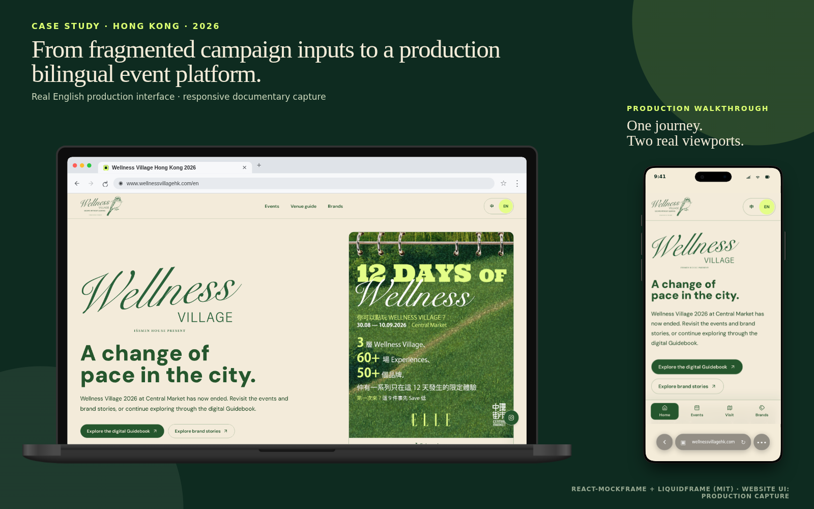

# Guided visitor journey

## The UX problem

A first-time visitor could arrive without knowing the event, its programme vocabulary or the structure of the supplied documents. The interface therefore begins with orientation and next actions, not with internal content ownership.

## The connected path

The intended path is continuous:

1. understand what Wellness Village is;
2. discover an activity and whether booking is required;
3. review preparation reminders before leaving;
4. find the venue, arrival notes and map; and
5. continue into brand stories and the digital Guidebook.

The homepage turns the middle of that path into three concrete tasks: choose an activity, read the before-you-go guidance and plan the visit. Stable bilingual anchors let the same destinations work from cards, navigation and shared links. Mobile navigation keeps the primary tasks reachable during the physical visit rather than hiding them behind a desktop information hierarchy.

The [visitor-journey diagram](../diagrams/visitor-journey.svg) shows the sequence and marks The Ground booking as an external hand-off.

## Progressive discovery and honest states

- Event orientation appears before the visitor has to understand filters or site structure.
- The programme can move from a concise preview into date-, category-, location-, price- and booking-aware discovery without duplicating the live schedule.
- Session cards separate timing from booking state and explain that registration continues on The Ground.
- Preparation reminders are placed beside the activity decision, where they can change what a visitor brings or does before arrival.
- The visit experience keeps address and direction actions ahead of detail, then adds arrival notes, the map and a text alternative.
- Empty search results suggest a valid next step, while a live-feed outage is labelled unavailable and retains a direct platform route. Neither state fabricates a schedule.
- Brand stories and the digital Guidebook remain a continuation of the visit rather than a disconnected archive.

## Verification

The delivered journey was checked across mobile Chromium, iPhone/WebKit and desktop Chromium, including stable anchors, touch targets, keyboard operation, language switching, horizontal overflow, link integrity and automated accessibility scans.

The portfolio image is a real application capture. The device frame is a presentation layer; no generated interface is substituted for the delivered product.

## Related evidence

- Implementation: [guided-home feature](../../src/features/home/) and [bilingual routes](../../src/app/)
- Tests: [visitor-journey component checks](../../src/features/home/) and [route checks](../../src/app/)
- Diagram: [visitor journey SVG](../diagrams/visitor-journey.svg) and [Mermaid source](../diagrams/visitor-journey.mmd)
- Decision record: [The Ground remains the booking source](../decisions/001-the-ground-is-the-live-source.md) and [reconstructed MVP brief](../agent-workflow/reconstructed-mvp-brief.md)
