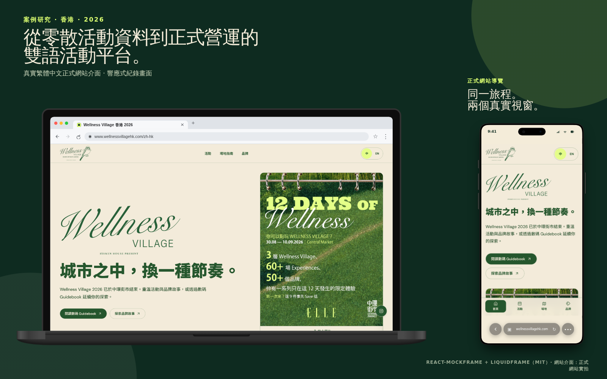

# 用手機測試流程後改變了甚麼

[English](03-visitor-journey.md) · [**繁體中文**](03-visitor-journey.zh-Hant.md)

客戶提供的素材可以解釋活動，但不會自動變成易用的網站流程。完成後的網站支援手機及桌面，而主要使用情境是訪客在活動前或活動期間以手機查看。我因此按照首次到訪者較可能提出的問題安排介面：這是甚麼活動？我可以參加甚麼？出發前要知道甚麼？場地在哪裡？

## 我希望訪客跟隨的路徑

1. 不用先讀完整本 Guidebook，亦能了解 Wellness Village；
2. 找到合適活動並查看是否需要報名；
3. 離開網站前閱讀實用提醒；
4. 找到地址、到場須知及地圖；
5. 繼續閱讀品牌故事及數碼 Guidebook。

[開啟完整尺寸圖表](https://raw.githubusercontent.com/jackyngtf/wellness-village-event-platform/refs/heads/main/docs/diagrams/visitor-journey.zh-Hant.svg)

[查看 Mermaid 原始檔](../diagrams/visitor-journey.zh-Hant.mmd)

## 把提示移到真正有用的位置

早期版本把 Experience 101 提示放在活動列表之後。在手機上，訪客可能先找到節目並按下 The Ground 連結，離開網站後仍未看到出發前要準備甚麼。

我把提示移到即時節目之前，刪除重複文字卡，並把客戶提供的九張圖片放進可左右掃動的圖片列，毋須先展開內容。其後才顯示活動列表、日期及分類控制、清楚的報名狀態，以及前往 The Ground 的操作。

[下載較高畫質 MP4](https://raw.githubusercontent.com/jackyngtf/wellness-village-event-platform/refs/heads/main/docs/media/programme-walkthrough-zh-Hant.mp4)

## 把不同頁面連成一條路徑

首頁早期版本有機會只像多個 section 的集合。我把操作整理成三項具體任務——選擇活動、準備到訪及尋找場地——並確保英文與繁體中文會到達對應內容。

場地頁先提供地址及方向操作，再顯示到場須知、兩頁地圖及全螢幕檢視器。電腦訪客可使用畫面上的箭嘴，手機訪客則可掃動同一組頁面。桌面版放大檢視會固定標題及翻頁控制，讓直向地圖在中間獨立捲動；這樣毋須把整張圖片縮得太小，地圖標示仍然容易閱讀。接近上線時有地圖細節需要修正，我直接準備更新後的網頁素材，沒有把印刷製作工作再交回正集中籌備活動的團隊。

品牌內容亦成為規劃到訪後的延續，而不是另一個孤立檔案區。搜尋及主題篩選會帶到簡短品牌故事、已確認的 Instagram、經核對的官方網站，以及相應 Guidebook 版面。

## 從真實裝置找到的細節

- 手機導覽讓節目、場地及品牌功能容易到達。
- Section link 在兩種語言都會前往對應內容。
- 切換語言時保留讀者位置，而不是每次返回頁首。
- 橫向圖片列清楚提示仍可掃動，亦不會令整個頁面橫向溢出。
- 搜尋沒有結果時會建議另一個操作；節目資料無法載入時，保留誠實的 The Ground 路徑，而不是顯示虛構活動。
- 地圖同時有頁面內檢視、全螢幕操作及文字版本。

## 我如何檢查完成後的流程

我在手機 Chromium、iPhone/WebKit 及桌面 Chromium 檢查整條路徑，包括 section link、觸控目標、鍵盤操作、語言切換、橫向溢出、外部連結及自動無障礙掃描。迭代期間亦在實體手機上打開 LAN build，因為桌面 responsive frame 未必會顯示所有間距及掃動問題。

作品集外框只用於呈現；當中的畫面來自已交付介面。

下一篇：[The Ground 活動如何變成節目表](04-the-ground-event-interface.zh-Hant.md) · [首頁導覽實作](../../src/features/home/) · [雙語 routes](../../src/app/)
