# Using The Ground without rebuilding its booking system

[**English**](04-the-ground-event-interface.md) · [繁體中文](04-the-ground-event-interface.zh-Hant.md)

The Ground already held the current activity listings and registration flow. Re-entering those sessions in the Wellness Village website would have created two timetables and two places to correct a change. I kept booking upstream and built a clearer browsing layer around it.

## Dividing the responsibilities

The Guidebook supplied fixed editorial stories. The Ground supplied current activity times, prices, public availability and registration destinations. The website joined those two experiences for visitors but did not let one source overwrite the other.

The programme page answers “what can I join?” with date, category, location, price and booking filters. When a visitor chooses an activity, registration continues on its corresponding The Ground page.

## Fetching the right catalogue

The server-side adapter requests the `upcoming` and `past` feeds for the configured organisation in parallel. It does not download a global catalogue and guess that an event belongs to Wellness Village from its title. Each admitted row must carry the expected numeric `companyId`; that value is checked before normalisation and then removed from the public result.

[View the Mermaid source](../diagrams/the-ground-event-interface.mmd)

## Turning provider rows into a useful programme

| Layer | What happens there |
| --- | --- |
| **The Ground response** | Supplies the event ID, organisation ID, title, start and end, public location, price and RSVP state. |
| **Server contract** | Validates the payload, keeps only approved public fields, converts timestamps to explicit HKT values, deduplicates and sorts. |
| **Visitor interface** | Derives exact phase, Today/Upcoming/Past navigation, reviewed categories, filter URLs, display order and the final action. |

Card status and date navigation answer different questions. A card is Upcoming, Live or Ended from its absolute timestamps. A date tab asks which Hong Kong calendar dates the activity occupies. This keeps an activity that ended earlier today under Today while still labelling the card Ended, and it handles overnight sessions without assigning a midnight end to the following day.

The five client-facing categories are Yoga & Flow, Pilates & Fitness, Sound & Mind Therapy, Lifestyle & Holistic, and Community & Culture. Classification uses exact confirmed phrases and reviewed title aliases rather than broad keyword guesses. One activity can match more than one category; an unmatched title stays visible under All events.

## What happens when the upstream service fails

The fully normalised catalogue stays in memory for five minutes. After one successful fetch, a short interruption can use the most recent copy and label it as older data. If no usable copy exists, the page says the programme is unavailable and keeps a direct route to The Ground. It does not invent a schedule or present an unchecked response as current.

Only rows checked against the configured organisation can create real The Ground links. The public demo uses `example.com`, so its fictional event IDs never reach the provider.

<strong>Adapter guardrails</strong>

- At most 50 records are requested per page and no more than 20 pages are followed per feed.
- Each upstream request stops after eight seconds; responses above 2 MiB are rejected, including streaming responses without a usable content length.
- Zod validates the payload and strict RFC3339 timestamps.
- Unexpected cursors, incoherent totals, changing feed metadata and incomplete or excess row sets are rejected.
- Events are deduplicated by ID before normalisation and sorting.
- Provider contacts, members, coaches, unsupported images, organisation IDs and internal state do not reach the page.
- Location filter keys use reversible UTF-8 base64url encoding so values such as `A+B`, `A B` and `中環` remain distinct.

The public reference received two small safeguards during its September publication review: it rejects event windows longer than 366 elapsed days, and price displays retain the currency's normal fractional precision. These are later reference-code fixes, not claims about what ran during the event.

## Integration boundary

This was a limited server-side integration with a public catalogue, not a formal partner API. I did not preserve the original endpoint-discovery session, so this chapter describes the adapter that was implemented and tested rather than recreating that research. A longer-term commercial integration would need agreed access, polling and content-reuse terms.

Next: [why the contact flow used Queue and Google Sheets](05-queue-to-sheets-interface.md) · [adapter source and tests](../../src/integrations/the-ground/) · [programme derivation](../../src/features/programme/) · [architecture decision](../decisions/001-the-ground-is-the-live-source.md)
