# 在不重建報名系統下使用 The Ground

[English](04-the-ground-event-interface.md) · [**繁體中文**](04-the-ground-event-interface.zh-Hant.md)

The Ground 已經保留最新活動列表及報名流程。如果把全部節目重新輸入 Wellness Village 網站，便會出現兩份時間表，以及兩個需要同步修正的地方。我把報名留在上游平台，只在網站建立較清楚的瀏覽層。

## 劃分兩邊的責任

Guidebook 提供固定編輯故事；The Ground 提供最新活動時間、價格、公開名額及報名連結。網站為訪客連接兩種體驗，但不會讓其中一個來源覆蓋另一個。

節目頁以日期、分類、位置、價格及報名狀態篩選，回答「我可以參加甚麼」。訪客選擇活動後，會在相應 The Ground 頁面繼續報名。

## 取得正確的活動目錄

伺服器端 adapter 平行讀取指定機構的 `upcoming` 及 `past` feeds，不會下載整個平台的活動，再從標題猜測哪些屬於 Wellness Village。每項獲接受的資料必須包含預期的數字 `companyId`；adapter 先核對機構，再於公開結果移除該欄位。

[開啟完整尺寸圖表](https://raw.githubusercontent.com/jackyngtf/wellness-village-event-platform/refs/heads/main/docs/diagrams/the-ground-event-interface.zh-Hant.svg)

[查看 Mermaid 原始檔](../diagrams/the-ground-event-interface.zh-Hant.mmd)

## 把 provider 資料變成可用節目表

| 層次 | 該層處理的事情 |
| --- | --- |
| **The Ground 回應** | 提供活動 ID、機構 ID、標題、開始與結束時間、公開位置、價格及 RSVP 狀態。 |
| **伺服器 contract** | 驗證 payload、只保留獲批准的公開欄位、把 timestamp 轉成明確 HKT 值、去重及排序。 |
| **訪客介面** | 衍生準確階段、今日／即將舉行／已結束導覽、經審閱分類、篩選 URL、顯示次序及最終操作。 |

活動卡狀態與日期導覽回答兩個不同問題。活動卡按絕對 timestamp 顯示即將舉行、進行中或已結束；日期分頁則判斷活動佔用哪些香港日曆日期。這樣，今日較早完結的活動仍可列於「今日」，同時在卡上標示已結束；過夜活動亦不會因午夜結束而錯誤佔用翌日。

五個訪客分類是 Yoga & Flow、Pilates & Fitness、Sound & Mind Therapy、Lifestyle & Holistic，以及 Community & Culture。分類只使用已確認完整字句及經審閱的標題 alias，不會以寬鬆關鍵字猜測。一項活動可以符合多個類別；未匹配標題仍會在「全部活動」出現。

## 上游服務失敗時的處理

完整標準化活動目錄會在記憶體保留五分鐘。成功取得資料後，短暫中斷可以使用最近一份資料並標示為較舊內容。如果完全沒有可用資料，頁面會說明節目無法載入，並保留前往 The Ground 的直接路徑，不會自行製造時間表或把未核對回應當成最新資料。

只有已核對指定機構的紀錄可以產生真實 The Ground 連結。公開示範使用 `example.com`，虛構 event ID 不會到達 provider。

<strong>Adapter 防護邊界</strong>

- 每頁最多要求 50 項，每個 feed 最多跟進 20 頁。
- 每個上游請求在八秒後停止；大於 2 MiB 的回應會被拒絕，包括沒有可用 content length 的串流回應。
- Zod 驗證 payload 及嚴格 RFC3339 timestamp。
- 異常 cursor、不一致的總數、途中改變的 feed metadata，以及不足或過量的資料列都會被拒絕。
- 活動按 ID 去重，再標準化及排序。
- Provider 聯絡人、會員、教練、不支援圖片、機構 ID 及內部狀態不會進入頁面。
- 位置 filter key 使用可逆 UTF-8 base64url 編碼，所以 `A+B`、`A B` 及 `中環` 仍是不同值。

公開參考程式在九月的發佈前檢查中補上兩項小修正：拒絕跨度超過 366 日的活動，並按貨幣正常的小數精度顯示票價。這些是其後對參考程式的修正，不代表活動期間的正式版本已經包含相同行為。

## 整合邊界

這是使用公開 catalogue 的有限度伺服器端整合，並非正式合作夥伴 API。我沒有保留最初尋找 endpoint 的完整 session，所以本章只描述已實作及測試的 adapter，不會重建不存在的研究過程。若作長期商業整合，仍需要雙方同意存取、polling 及內容重用條款。

下一篇：[為何聯絡流程使用 Queue 及 Google Sheets](05-queue-to-sheets-interface.zh-Hant.md) · [adapter 程式碼及測試](../../src/integrations/the-ground/) · [節目衍生邏輯](../../src/features/programme/) · [架構決定](../decisions/001-the-ground-is-the-live-source.zh-Hant.md)
