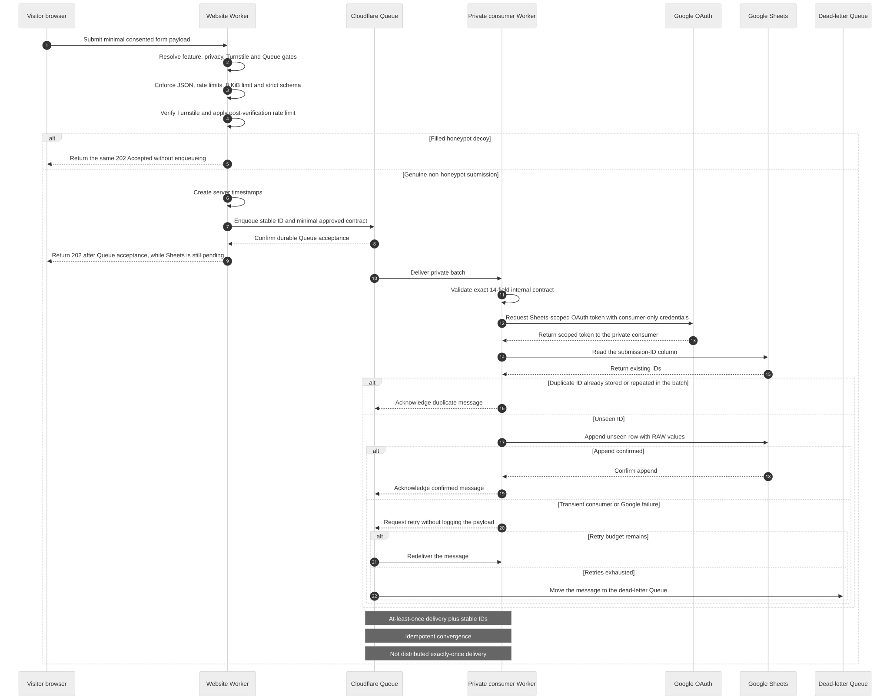

# Keeping lead capture simple without exposing Google credentials

[**English**](05-queue-to-sheets-interface.md) · [繁體中文](05-queue-to-sheets-interface.zh-Hant.md)

Wellness Village needed a way for interested visitors to leave their details. It did not yet need a customer database. This was the event's first edition, expected volume was modest and the organiser had not decided what a later event or longer-term contact workflow would look like.

## Why Google Sheets fitted the first edition

Google Sheets was a project choice, not an existing client process. I considered Firebase and Supabase, then chose the smaller operating surface while the future workflow was still uncertain.

| Option | How I assessed it for this release |
| --- | --- |
| **Google Sheets** | A small, single-writer list was enough for the expected volume. It was easy to inspect and hand over, with no separate application datastore to operate. |
| **Firebase or Supabase** | Either could support richer queries and future product features, but would require earlier decisions about data modelling, access and ongoing operation before those needs were known. |

Setup, maintenance and likely cost all mattered, but I did not keep a like-for-like historical price comparison. The decision was about proportionality, not a claimed dollar saving. If the volume, workflow or later editions become more demanding, the datastore should be reconsidered.

## Separating the public form from Google

I did not let the browser write directly to a Sheet. The public website validates the request and places an accepted internal message on Cloudflare Queue. A separate private Worker owns the Google credentials, reads the Queue and appends a row only when the submission ID is not already present.

[Open the full-size diagram](https://raw.githubusercontent.com/jackyngtf/wellness-village-event-platform/refs/heads/main/docs/diagrams/queue-to-sheets-sequence.svg)

[View the Mermaid source](../diagrams/queue-to-sheets-sequence.mmd)

This arrangement keeps Google response time out of the visitor request and Google credentials out of the browser and main website Worker. The Queue is a delivery buffer, not long-term lead storage.

## From the browser to the Queue

Before the route reads personal data, it checks that contact collection, the approved privacy-notice version, Turnstile, the Queue binding and both rate limiters are configured. Missing configuration stops the route before it processes the form.

An enabled request then passes a body-size limit, strict schema, honeypot, server-side Turnstile check and two-stage rate limiting. Extra fields are rejected. The server adds UTC and Hong Kong timestamps and retains only a same-origin pathname as source metadata—never its query string or fragment.

The public portfolio keeps contact collection off and does not render the form, so readers can run the demo without collecting anyone's details.

## What `202 Accepted` means

For a genuine submission, the route waits until Cloudflare Queue accepts the message and then returns `202 Accepted`. A filled honeypot receives the same public response but is not queued, so the response does not reveal the anti-spam decision.

`202` does **not** mean that Google Sheets has already written a row. The private consumer completes that work asynchronously.

## From the Queue to one Sheet row

The consumer has no public route. It validates the exact internal message, obtains a Sheets-scoped OAuth token and checks column A for the stable submission ID. It collapses duplicate IDs within the same batch, skips IDs already present and appends unseen rows with `valueInputOption=RAW`, so visitor text is not interpreted as a formula.

<strong>The 14-column Sheet contract</strong>

| Column | Field | Purpose |
| --- | --- | --- |
| A | `submission_id` | Stable UUID and deduplication key |
| B | `submitted_at_utc` | Server timestamp in UTC |
| C | `submitted_at_hkt` | The same instant with Hong Kong offset |
| D | `last_name` | Validated surname |
| E | `first_name` | Validated given name |
| F | `display_name` | Locale-aware derived display name |
| G | `email` | Validated email address |
| H | `phone` | Validated telephone value |
| I | `locale` | `en` or `zh-hk` |
| J | `source_page` | Same-origin pathname or `unknown` |
| K | `consent` | Literal `true` |
| L | `consent_version` | Version tied to the published notice |
| M | `purpose` | Fixed approved processing purpose |
| N | `marketing_opt_in` | Literal `true` for this contract |

## Retries, duplicates and the point to outgrow this design

Cloudflare Queues deliver at least once. A transient Google failure retries the unconfirmed message; exhausted messages go to a dead-letter Queue for operator review. If an append succeeds but its response is lost, the retry can recognise the stable ID before another append.

This should make ordinary retries settle on one row, but it is not distributed exactly-once delivery. The read-before-append check assumes one consumer writing to one Sheet, so `max_concurrency` remains `1`. A higher-volume or multi-writer workflow should move uniqueness into a transactional datastore rather than scaling this pattern sideways.

Logs contain event names, counts and upstream status—not form values or credentials. Retention, withdrawal requests, monitoring and dead-letter recovery still require an operator.

Next: [how the site launched on Cloudflare](06-cloudflare-delivery.md) · [producer and route](../../src/features/interest/) · [private consumer](../../workers/contact-sheet-consumer/) · [architecture decision](../decisions/003-queue-before-google-sheets.md)
