# Production economics and observability

## Why economics belongs in the case study

The delivery was not only a collection of pages. It was a time-bound production system that had to be available during a 12-day public event without introducing infrastructure that the client would need to operate long after the campaign.

The economic decision was therefore to reuse clear systems of record, keep the application stateless where practical and pay for specialised infrastructure only where it improved a real boundary:

- The Ground retained event and booking authority;
- Google Sheets remained the client's lead-operating surface;
- Cloudflare Workers ran the full-stack Next.js application;
- edge caching and deployment assets absorbed repeat delivery;
- R2 and a Durable Object supported incremental cache and revalidation;
- Queue delivery isolated the public request from Google credentials and latency; and
- Turnstile plus rate limits protected the deliberately small contact workflow.

This avoided adding a general database or CRM solely for the campaign. That is an architecture choice, not a claim that third-party services or engineering labour were free.

## Observed event-window workload

The public [sanitised aggregate record](../evidence/production-metrics/event-window-aggregates.json) preserves the following read-only Cloudflare observations:

| Layer | Event-window observation | What it establishes |
| --- | ---: | --- |
| Cloudflare edge | 108,443 HTTP requests | Total request handling, including documents, assets, crawlers and threats—not people |
| HTML delivery | 4,322 page views | Successful HTML responses under Cloudflare's definition—not distinct visitors |
| Response delivery | 4.34 GB | Response bytes served at the edge during the UTC daily-roll-up window |
| Cache | 78.5% of response bytes cached | Most response bytes were delivered from cache rather than counted as uncached bytes |
| Worker runtime | approximately 35,600 invocations | Requests that reached the application runtime; adaptive analytics can be sampled |
| Worker CPU | approximately 2.335 million CPU milliseconds | Work performed by this Worker during the exact HKT event window |
| R2 cache snapshot | 68.8 MB across 696 objects | Latest observed incremental-cache footprint in the window, not a monthly storage invoice |

Edge requests, page views and Worker invocations are intentionally not merged. They measure different layers. Daily unique-IP counts are also excluded because adding them across days would double-count recurring clients and still would not distinguish people from automated traffic.

Cloudflare documents that Free-plan HTTP traffic includes legitimate users, crawlers and threats, that one page view typically requires many requests and that page views count successful HTML responses. Adaptive GraphQL datasets may be estimates. The [evidence note](../evidence/production-metrics/README.md) retains these definitions beside the figures.

## Cost evidence without false precision

Three cost layers are deliberately separated:

1. **direct project spend** — the Porkbun invoice records US$11.08 for one year of `wellnessvillagehk.com` registration on 19 August 2026;
2. **account-level Cloudflare billing** — the complete 12 August–11 September 2026 billing period reported US$0.00 in usage charges, with every displayed usage category inside its included quantity; and
3. **public rate cards** — useful for explaining the architecture's cost position, but not a substitute for an attributable invoice.

Workers Paid was active during the authenticated check. A zero usage charge therefore does **not** mean the Cloudflare account, the project or the engineering work cost nothing. The Cloudflare account also contained other products and workloads, so base invoices are not allocated to this project without line-item evidence. The sanitised [billing and domain summary](../evidence/production-metrics/billing-and-domain-summary.json) preserves only the evidence needed for this case study and excludes order, invoice, account and payment identifiers.

| Component | Observed decision or usage | Public rate-card position | What is not claimed |
| --- | --- | --- | --- |
| Domain registration | Porkbun invoice: US$11.08 paid for one year on 19 August 2026; expiry 19 August 2027 | Direct, project-attributable first-year cost | Future renewal pricing or total ownership cost |
| DNS, TLS and CDN | The Cloudflare zone reported the Free Website plan | No separate zone-plan usage charge was identified in the captured billing view | That every Cloudflare account service was free |
| Workers and OpenNext | Project event window: about 35,600 invocations and 2.335 million CPU ms. Account billing cycle: 46.46k Standard requests and 2.9 million CPU ms, both with zero billable usage | The captured Workers Paid rate card had a US$5 account/month minimum and included 10 million requests plus 30 million CPU ms | That the US$5 rate card is a project-only invoice or that account traffic belongs only to this site |
| R2 incremental cache | Project event snapshot: 68.8 MB. Account billing cycle: 0.04 GB-month, 9.21k Class A and 51.74k Class B operations, all with zero billable usage | Standard storage included 10 GB-month, 1 million Class A and 10 million Class B operations | A project-only monthly R2 bill from shared-account figures |
| Queue delivery | The authenticated billing view showed zero usage charge and usage inside the included quantity; exact operations remain withheld because they could be misread as lead volume | Current allowance is 10,000 operations per day on Workers Free or 1 million per month on Workers Paid | The number of leads, completed Sheet writes or a Queue-only project cost |
| Turnstile | Used for server-side verification of the contact flow | Free plan includes unlimited challenges within its product limits | An absence of abuse, conversion uplift or a security guarantee |
| Google Sheets and The Ground | Existing client-owned operational systems remained authoritative | Outside the Cloudflare bill and this public cost assessment | That either external service was free or that their commercial terms are public |

Official references: [Workers pricing](https://developers.cloudflare.com/workers/platform/pricing/), [R2 pricing](https://developers.cloudflare.com/r2/pricing/), [Queues pricing](https://developers.cloudflare.com/queues/platform/pricing/) and [Turnstile plans](https://developers.cloudflare.com/turnstile/plans/).

The defensible conclusion is narrow: **the observed campaign workload sat comfortably below the published included quantities, and the complete account billing period recorded no usage overage.** The directly attributable first-year domain cost was US$11.08. Low variable infrastructure consumption demonstrates proportionate engineering; it does not make the product scope, client work or event small, and it is not the project's total cost.

## Why Workers, not static Pages

The delivered runtime was OpenNext on Cloudflare Workers. It needed server rendering, API routes, a server-only The Ground adapter, Queue production, R2 incremental cache, Durable Object revalidation and privacy gates. A static Pages-only export could not provide that complete runtime.

Cloudflare Pages remains a useful product, and Pages Functions use Workers billing, but listing Pages as the delivered host would make the case study less accurate. The architecture decision is documented in [ADR 002](../decisions/002-workers-not-static-pages.md).

## Measurement boundaries

[Inspect the Mermaid source](../diagrams/production-measurement-boundaries.mmd) · [Read the aggregate evidence note](../evidence/production-metrics/README.md)

## What these figures do not prove

- They do not establish event attendance or count distinct people.
- They do not establish booking conversion, lead quality, revenue, ROI or campaign causation.
- They do not establish a long-term SLA from a 12-day event window.
- They do not establish a project-only Cloudflare invoice, total cost of ownership or engineering labour.
- They do not turn shared-account billing-cycle usage into project-specific traffic.

Those exclusions are part of the result: the portfolio shows how operational evidence was interpreted, not only how it was collected.
