# 正式環境紀錄：流量與成本

[English](07-production-economics-and-observability.md) · [**繁體中文**](07-production-economics-and-observability.zh-Hant.md)

## 為何案例需要交代成本

網站需要支援一個 12 日公開活動，同時不應為客戶留下不必要的系統要在活動後維護。因此，我讓每項服務只負責一項清楚工作：

- The Ground 保留最新節目及報名；
- Google Sheets 作為首屆活動選用的簡單聯絡資料目的地；
- Cloudflare Workers 執行 full-stack Next.js 應用程式；
- edge cache 及 deployment assets 承擔重複傳輸；
- R2 及 Durable Object 支援 incremental cache 及 revalidation；
- Queue 把公開請求與 Google 憑證及延遲分隔；以及
- Turnstile 及 rate limit 保護小型聯絡表格。

這樣不用只為活動另建資料庫或 CRM。以下成本部分只記錄可以合理定價的服務，不會把第三方服務或開發工作說成免費。

## 活動時段觀察到的數字

[彙總紀錄](../evidence/production-metrics/event-window-aggregates.json)保留以下 read-only Cloudflare 數據：

| 層次 | 活動時段觀察 | 可說明的事項 |
| --- | ---: | --- |
| Cloudflare edge | 108,443 HTTP requests | 包括文件、assets、爬蟲及威脅的總請求，不是人數 |
| HTML delivery | 4,322 page views | 按 Cloudflare 定義成功回傳的 HTML，不是獨立訪客 |
| Response delivery | 4.34 GB | UTC daily roll-up 時段內由 edge 傳輸的 response bytes |
| Cache | 78.5% response bytes cached | 大部分 response bytes 由 cache 提供 |
| Worker runtime | 約 35,600 次調用 | 到達應用程式 runtime 的請求；adaptive analytics 可能經抽樣 |
| Worker CPU | 約 2.335 million CPU milliseconds | 準確 HKT 活動時段內該 Worker 的運算量 |
| R2 cache snapshot | 696 個 objects，共 68.8 MB | 時段內最新 incremental-cache snapshot，不是月度儲存帳單 |

edge requests、page views 及 Worker invocations 量度不同事情，所以沒有相加。每日 unique IP 亦沒有累加成訪客數，因為同一人或自動流量可以在多日重複出現。

[證據說明](../evidence/production-metrics/README.zh-Hant.md)保留各項定義及限制。另一份 Search Console 報告在與活動日期對齊的 Pacific Time 時段記錄 112 次點擊、362 次曝光、30.9% CTR 及平均排名 3.5。[搜尋章節](08-search-discoverability.zh-Hant.md)說明日期及索引限制。

## 各組數字之間的關係

[查看 Mermaid 原始檔](../diagrams/production-measurement-boundaries.zh-Hant.mmd) · [閱讀彙總證據說明](../evidence/production-metrics/README.zh-Hant.md)

## 活動前的資源限制事故

8 月 27 日，正式網站短暫回傳 Cloudflare Error 1102（`Worker exceeded resource limits`）。當時診斷與 Free plan 的每次請求 CPU 上限相符。我把共享 Cloudflare 帳戶轉到 Workers Paid，同時減少會使用較多 CPU 的 request path；活動開始前亦繼續做 runtime hardening。

其後帳戶檢查確認 Workers Paid 已啟用，implementation history 亦記錄 CPU 優化。但現有紀錄不能把效果準確分拆，所以我不會說單靠升級方案便解決問題。這段紀錄亦解釋了為何項目採用付費 baseline，以及為何成本不能只寫成 US$0.00。

## 成本如何呈現

我把四類資料分開：

1. **項目直接支出：**Porkbun 帳單記錄 2026 年 8 月 19 日以 US$11.08 註冊 `wellnessvillagehk.com` 一年；
2. **帳戶基本方案：**其後檢查時 Workers Paid 已啟用，當時價目表顯示帳戶基本月費 US$5；
3. **額外用量費：**完整的 2026 年 8 月 12 日至 9 月 11 日帳單週期顯示 US$0.00，各項顯示用量均在方案包括額度內；以及
4. **公開價目表：**用來解釋額度及架構的成本位置，但不能代替可歸屬項目的帳單。

因此，US$0.00 是**額外用量費**，並非 Cloudflare 總成本。該帳戶亦有其他產品及工作負載；沒有可直接分攤的 line item 時，我不會把整筆 US$5 基本月費稱為只屬於本項目的帳單。[帳單與網域摘要](../evidence/production-metrics/billing-and-domain-summary.json)已移除帳戶、訂單、付款及個人識別資料。

| 項目 | 觀察到的決定或用量 | 當時公開價目表位置 | 不作出的推論 |
| --- | --- | --- | --- |
| 網域註冊 | 2026 年 8 月 19 日支付 US$11.08，首年到期日為 2027 年 8 月 19 日 | 可直接歸屬本項目的首年成本 | 續期價格或 total cost of ownership |
| DNS、TLS 及 CDN | Cloudflare zone 顯示 Free Website plan | 擷取帳單畫面未見獨立 zone-plan 用量費 | 所有 Cloudflare 服務均免費 |
| Workers 及 OpenNext | Workers Paid 已啟用；活動時段約 35,600 次 invocations、2.335 million CPU ms；帳單週期顯示 46.46k Standard requests 及 2.9 million CPU ms，額外 billable usage 為零 | 當時 Workers Paid 價目表為每帳戶每月最低 US$5，包括 10 million requests 及 30 million CPU ms | 整筆 US$5 是本項目獨佔帳單，或帳戶流量全部屬於本網站 |
| R2 incremental cache | 項目 snapshot 68.8 MB；帳單週期 0.04 GB-month、9.21k Class A 及 51.74k Class B operations，額外 billable usage 為零 | Standard storage 包括 10 GB-month、1 million Class A 及 10 million Class B operations | 從共享帳戶數字推算項目專屬 R2 月費 |
| Queue delivery | 已驗證帳單畫面顯示用量在包括額度內；準確 operations 不公開，以免被誤讀為 lead 數量 | Workers Free 每日 10,000 operations；Workers Paid 每月 1 million | lead 數量、成功 Sheet writes 或 Queue-only 項目成本 |
| Turnstile | 用於 server-side 驗證聯絡流程 | Free plan 在產品限制內提供 unlimited challenges | 沒有濫用、提升轉換或安全保證 |
| Google Sheets 及 The Ground | Google Sheets 是首屆活動選用的聯絡資料目的地；The Ground 繼續處理活動及報名 | 不屬 Cloudflare 帳單或本公開成本評估；沒有保留 Firebase 或 Supabase 的同類價格比較 | 兩項外部服務免費、其商業條款公開，或已量度出準確資料庫節省金額 |

官方資料：[Workers pricing](https://developers.cloudflare.com/workers/platform/pricing/)、[R2 pricing](https://developers.cloudflare.com/r2/pricing/)、[Queues pricing](https://developers.cloudflare.com/queues/platform/pricing/)及 [Turnstile plans](https://developers.cloudflare.com/turnstile/plans/)。

在已檢查時段，用量低於公開的包括額度，完整帳單週期沒有額外用量費；共享帳戶仍有每月 US$5 的 Workers Paid 基本方案。可直接歸屬本項目的首年網域費為 US$11.08。這些數字不包括開發時間、共享月費的項目分攤或客戶其他服務。

## 為何是 Workers，而非純靜態 Pages

已交付 runtime 是 Cloudflare Workers 上的 OpenNext，需要 server rendering、API routes、server-only The Ground adapter、Queue production、R2 incremental cache、Durable Object revalidation 及私隱閘門。純靜態 Pages export 不能提供完整 runtime。

Cloudflare Pages 對靜態網站仍然有用，但不是本項目使用的 host。相關決定記錄在 [ADR 002](../decisions/002-workers-not-static-pages.zh-Hant.md)。

## 這些數字不能告訴我們甚麼

- 不能證明活動入場人數或獨立人數。
- 不能證明報名轉換、lead 質素、收入、ROI 或活動因果關係。
- 不能由 12 日活動時段推論長期 SLA。
- 不能證明項目專屬 Cloudflare 帳單、total cost of ownership 或工程工時。
- 不能把共享帳戶的帳單週期用量當成本項目專屬流量。
- 不能把與活動日期對齊的 Search Console property 總數或某日索引 snapshot 說成廣泛 SEO 成功或永久索引覆蓋。

我把這些限制放在數字旁邊，避免把流量、搜尋及帳戶計費誤寫成訪客或商業結果。
