# Production record: search discovery

[**English**](08-search-discoverability.md) · [繁體中文](08-search-discoverability.zh-Hant.md)

## What Search Console adds

Cloudflare told me how the website handled requests. Search Console answered a different question: whether Google had found the site and how it appeared in search. I kept the two reports separate because neither one counts event attendance or registrations caused by the website.

## `robots.txt` and sitemap

Read-only checks on 18 September 2026 confirmed that the production site served:

- a `robots.txt` that allowed public routes, excluded `/api/` and identified the sitemap; and
- a sitemap with 12 locale URLs: six routes in Traditional Chinese and English, with `zh-HK`, `en` and `x-default` alternate links.

Copies of [robots.txt](../evidence/search-discoverability/robots.txt) and [sitemap.xml](../evidence/search-discoverability/sitemap.xml) are kept here in case the campaign domain is retired.

These files show what the website served on that date. They do not mean that Google fetched or indexed every URL. The runnable portfolio demo uses `noindex` because it is not intended to replace the campaign site.

## From sitemap to search results

[Open the full-size diagram](https://raw.githubusercontent.com/jackyngtf/wellness-village-event-platform/refs/heads/main/docs/diagrams/search-discovery-lifecycle.svg)

[View the Mermaid source](../diagrams/search-discovery-lifecycle.mmd).

The diagram keeps technical publishing steps separate from Google's later observations. It is a sequence of dated checks, not a funnel that attributes clicks, attendance or registrations to any one step.

## Search Console setup

During a read-only check on 18 September, the existing `wellnessvillagehk.com` Domain property showed verified-owner status. The property had been added on 21 August 2026. I did not create a new property, submit a sitemap or change DNS or Search Console settings while preparing this portfolio.

The retained [sanitised Search Console record](../evidence/search-discoverability/search-console-summary.json) excludes the account identity, screenshots, permission listings and raw low-volume queries.

## Search results during the event dates

The Search results Performance report was filtered to Web Search and the inclusive calendar dates 30 August–10 September 2026:

| Metric | Search Console result |
| --- | ---: |
| Clicks | 112 |
| Impressions | 362 |
| Displayed CTR | 30.9% |
| Average position | 3.5 |

Search Console uses Pacific Time for non-24-hour performance dates. These 12 calendar labels were selected to mirror the Hong Kong event dates, so this is an **event-aligned PT window**, not an exact `Asia/Hong_Kong` hour-for-hour interval. The daily rows are retained in the sanitised record with that timezone boundary.

The Traditional Chinese home route, `/zh-hk`, was the largest landing-page row shown, with 98 clicks and 315 impressions. This should not be converted into a share of the property total because Google aggregates property and page tables differently. I also left out the query table because it contained low-volume searches.

## Later indexing snapshots

These are later operational snapshots, not metrics from the PT performance window:

| Search Console report | Snapshot | Result | How to read it |
| --- | --- | --- | --- |
| Sitemaps | Last read 14 September 2026 | Submitted 21 August; status `Success`; 12 discovered pages and 0 videos | Confirms Google's submitted-sitemap record, not permanent indexing |
| Page indexing, sitemap scope | Updated 14 September 2026 | 6 of 12 submitted URLs indexed; 6 not indexed | The six excluded URLs were reported as one `noindex`, one 404 and four discovered but not yet indexed; the report does not establish a root-cause audit |
| Event enhancement | Updated 16 September 2026 | 1 valid item and 0 invalid items | Optional improvement notices remained for `offers`, `performer` and `organizer` |
| Core Web Vitals | Updated 16 September 2026 | Insufficient 90-day field data for mobile and desktop | No real-user Core Web Vitals result is claimed |
| HTTPS | Updated 11 September 2026 | 1 HTTPS URL and 0 non-HTTPS URLs in the report | This summary is not treated as a crawl of every route |

The indexing figures are a dated snapshot, not a permanent result. Search clicks are also not converted into visits, attendance or a general SEO score; average position changes with the search terms, location, device and other context.

Official references: [Performance report](https://support.google.com/webmasters/answer/7576553?hl=en), [Performance data and aggregation](https://support.google.com/webmasters/answer/17011364?hl=en), [Sitemaps report](https://support.google.com/webmasters/answer/7451001?hl=en), [Page indexing report](https://support.google.com/webmasters/answer/7440203?hl=en) and [Core Web Vitals report](https://support.google.com/webmasters/answer/9205520?hl=en).

## What I learned

Verifying the property and submitting the sitemap before the event made it possible to review search results afterwards. The remaining gaps are straightforward: the performance dates use PT rather than an exact HKT window, only half of the submitted URLs were indexed in the 14 September snapshot, and there was not enough field data for Core Web Vitals.
