# 正式環境紀錄：搜尋曝光

[English](08-search-discoverability.md) · [**繁體中文**](08-search-discoverability.zh-Hant.md)

## Search Console 補充了甚麼

Cloudflare 告訴我網站如何處理請求；Search Console 回答另一個問題：Google 有沒有找到網站，以及網站如何出現在搜尋結果。我把兩份報告分開，因為兩者都不等於活動入場人數，亦不能量度由網站帶來的報名。

## `robots.txt` 與 sitemap

2026 年 9 月 18 日的 read-only 檢查確認正式網站提供：

- 一份容許抓取公開 routes、排除 `/api/` 並指出 sitemap 的 `robots.txt`；以及
- 包含 12 個 locale URL 的 sitemap：繁體中文及英文各六個 routes，並有 `zh-HK`、`en` 及 `x-default` alternate link。

[robots.txt](../evidence/search-discoverability/robots.txt)及 [sitemap.xml](../evidence/search-discoverability/sitemap.xml)副本保留在儲存庫，以免活動網域日後停用。

這些檔案只能證明網站在擷取日提供的內容，不能表示 Google 已抓取或索引每個 URL。可執行作品集 demo 使用 `noindex`，因為它不應取代正式活動網站。

## 由 sitemap 到搜尋結果

[開啟完整尺寸圖表](https://raw.githubusercontent.com/jackyngtf/wellness-village-event-platform/refs/heads/main/docs/diagrams/search-discovery-lifecycle.zh-Hant.svg)

[查看 Mermaid 原始檔](../diagrams/search-discovery-lifecycle.zh-Hant.mmd)。

圖表把網站發佈步驟與 Google 其後提供的觀察分開。這是一組有日期的檢查，不是把點擊、入場或報名歸因到其中一步的 funnel。

## Search Console 設定

9 月 18 日 read-only 檢查時，既有 `wellnessvillagehk.com` Domain property 顯示 verified-owner 狀態；property 於 2026 年 8 月 21 日加入。整理作品集期間，我沒有新增 property、提交 sitemap，亦沒有改動 DNS 或 Search Console 設定。

[經整理的 Search Console 紀錄](../evidence/search-discoverability/search-console-summary.json)不包括帳戶身份、截圖、權限列表或低流量 query 原始資料。

## 活動日期內的搜尋結果

Search results Performance report 設為 Web Search，日期選擇 2026 年 8 月 30 日至 9 月 10 日（包括首尾兩日）：

| 指標 | Search Console 結果 |
| --- | ---: |
| Clicks | 112 |
| Impressions | 362 |
| 顯示 CTR | 30.9% |
| Average position | 3.5 |

Search Console 對非 24 小時 performance 日期使用 Pacific Time。這 12 個日曆標籤是為了對齊香港活動日期，因此屬於**與活動日期對齊的 PT 時段**，不是準確的 `Asia/Hong_Kong` 小時區間。

繁體中文首頁 `/zh-hk` 是顯示中最大的 landing-page row，錄得 98 clicks 及 315 impressions。由於 Google 對 property 及 page tables 的 aggregation 方式不同，我沒有把它換算成 property 總數比例。query table 因包含低流量搜尋字詞而不公開。

## 其後的索引 snapshot

以下是較後期的營運 snapshot，不是上述 PT performance window 內的指標：

| Search Console report | Snapshot | 結果 | 解讀方式 |
| --- | --- | --- | --- |
| Sitemaps | 最後讀取 2026 年 9 月 14 日 | 8 月 21 日提交；狀態 `Success`；12 個 discovered pages、0 videos | 確認 Google 的 submitted-sitemap 紀錄，不是永久索引 |
| Page indexing，sitemap scope | 更新於 2026 年 9 月 14 日 | 12 個已提交 URL 中 6 個 indexed、6 個 not indexed | 六個排除 URL 顯示為一個 `noindex`、一個 404 及四個 discovered but not yet indexed；不是完整根因審計 |
| Event enhancement | 更新於 2026 年 9 月 16 日 | 1 個 valid item、0 invalid items | `offers`、`performer` 及 `organizer` 仍有可選改善提示 |
| Core Web Vitals | 更新於 2026 年 9 月 16 日 | Mobile 及 desktop 都沒有足夠 90 日 field data | 不宣稱 real-user Core Web Vitals 結果 |
| HTTPS | 更新於 2026 年 9 月 11 日 | 報告內 1 個 HTTPS URL、0 non-HTTPS URLs | 不視為每個 route 的完整 crawl |

索引數字只代表當日 snapshot。搜尋點擊亦不會被換算成 visits、入場或綜合 SEO 分數；average position 會受搜尋詞、位置、裝置等因素影響。

官方資料：[Performance report](https://support.google.com/webmasters/answer/7576553?hl=zh-Hant)、[Performance data and aggregation](https://support.google.com/webmasters/answer/17011364?hl=zh-Hant)、[Sitemaps report](https://support.google.com/webmasters/answer/7451001?hl=zh-Hant)、[Page indexing report](https://support.google.com/webmasters/answer/7440203?hl=zh-Hant)及 [Core Web Vitals report](https://support.google.com/webmasters/answer/9205520?hl=zh-Hant)。

## 我得到的實際經驗

在活動前驗證 property 及提交 sitemap，令活動後可以檢查搜尋結果。現有缺口亦很清楚：performance 日期以 PT 而非準確 HKT 計算、9 月 14 日只有一半已提交 URL 被索引，以及當時未有足夠的 Core Web Vitals 實際使用資料。
