# The story behind the build

[**English**](README.md) · [繁體中文](README.zh-Hant.md)

The main [README](../../README.md) is the five-minute version. These six chapters tell the project in the order it unfolded: a short deadline, a large amount of source material, product changes found through real-device review, two external-system interfaces and a production incident before the event opened.

## Six chapters

| Chapter | What it covers |
| --- | --- |
| [1. A deadline, scattered inputs and one developer](01-context-and-role.md) | The starting point, my role, the client relationship and what reached launch |
| [2. Turning a 184-page Guidebook into usable content](02-guidebook-and-agent-workflow.md) | How I divided the source material, used an Agent for bounded work and checked 48 brand profiles |
| [3. What changed after testing the journey on a phone](03-visitor-journey.md) | The homepage-to-programme path, before-you-go guidance, venue map and bilingual details |
| [4. Using The Ground without rebuilding booking](04-the-ground-event-interface.md) | How organisation-scoped listings became date, status and category views while registration stayed upstream |
| [5. Keeping lead capture simple without exposing Google credentials](05-queue-to-sheets-interface.md) | Why the first edition used Google Sheets, and how Queue delivery separated the public form from Google |
| [6. Launching on Cloudflare and handling the first incident](06-cloudflare-delivery.md) | Why the site ran on Workers, how releases were checked and what changed after Error 1102 |

## Choose a shorter route

[Open the full-size diagram](https://raw.githubusercontent.com/jackyngtf/wellness-village-event-platform/refs/heads/main/docs/diagrams/portfolio-reader-paths.svg)

[Inspect the Mermaid source](../diagrams/portfolio-reader-paths.mmd)

| If you are looking for… | Start with… |
| --- | --- |
| **Product and client judgement** | [Role and delivery](01-context-and-role.md) → [Visitor journey](03-visitor-journey.md) → [Lessons](09-lessons-and-limitations.md) |
| **Hands-on AI experience** | [Guidebook story](02-guidebook-and-agent-workflow.md) → [Working with an Agent](../agent-workflow/working-with-an-agent.md) → [Reconstructed MVP brief](../agent-workflow/reconstructed-mvp-brief.md) |
| **Full-stack integration** | [The Ground](04-the-ground-event-interface.md) → [Queue to Sheets](05-queue-to-sheets-interface.md) → [Cloudflare](06-cloudflare-delivery.md) |
| **Implementation detail** | [Implementation map](10-evidence-index.md) → [Architecture decisions](../decisions/README.md) → [Release checklist](../agent-workflow/release-checklist.md) |

## Reference notes

The main story stays readable; the dated and technical material sits behind it:

- [Delivery record](delivery-timeline.md) — milestones from the 5 August home-server MVP to event support;
- [Traffic and cost](07-production-economics-and-observability.md) — Cloudflare usage, the paid baseline and direct domain cost;
- [Search discovery](08-search-discoverability.md) — sitemap, indexing and the event-aligned Search Console period;
- [What I would keep and change](09-lessons-and-limitations.md) — practical follow-up rather than retrospective success claims; and
- [Implementation map](10-evidence-index.md) — where the main statements connect to code, tests or a dated source note.

Private messages and restricted client material remain private. Cleaned-up records are included only where they help a reader understand a date, number or technical decision.
