# 開發背後的故事

[English](README.md) · [**繁體中文**](README.zh-Hant.md)

主 [README](../../README.zh-Hant.md)是五分鐘版本。以下六篇內容按項目實際發展次序，交代短時間內如何處理大量資料、從真機審閱找到產品改動、接駁兩個外部系統，以及在活動開始前處理一次正式環境事故。

## 六篇主要內容

| 章節 | 內容 |
| --- | --- |
| [1. 一個限期、分散的資料與一名開發者](01-context-and-role.zh-Hant.md) | 項目起點、我的角色、與客戶的分工，以及最後交付的內容 |
| [2. 把 184 頁 Guidebook 變成可用內容](02-guidebook-and-agent-workflow.zh-Hant.md) | 如何劃分資料來源、以 Agent 處理範圍明確的工作，並檢查 48 個品牌專題 |
| [3. 用手機測試流程後改變了甚麼](03-visitor-journey.zh-Hant.md) | 由首頁到節目、活動前須知、場地地圖及雙語細節的調整 |
| [4. 在不重建報名系統下使用 The Ground](04-the-ground-event-interface.zh-Hant.md) | 指定機構的活動如何變成日期、狀態與分類介面，而報名仍留在上游平台 |
| [5. 在不暴露 Google 憑證下簡化聯絡資料收集](05-queue-to-sheets-interface.zh-Hant.md) | 為何首屆活動選用 Google Sheets，以及 Queue 如何把公開表格與 Google 分開 |
| [6. 在 Cloudflare 上線並處理首個正式環境事故](06-cloudflare-delivery.zh-Hant.md) | 為何網站在 Workers 執行、如何檢查發佈，以及 Error 1102 後改變了甚麼 |

## 選擇較短的閱讀路線

[查看 Mermaid 原始檔](../diagrams/portfolio-reader-paths.zh-Hant.mmd)

| 如果你想了解…… | 建議先閱讀…… |
| --- | --- |
| **產品與客戶判斷** | [角色與交付](01-context-and-role.zh-Hant.md) → [訪客流程](03-visitor-journey.zh-Hant.md) → [經驗](09-lessons-and-limitations.zh-Hant.md) |
| **AI 實作經驗** | [Guidebook 故事](02-guidebook-and-agent-workflow.zh-Hant.md) → [與 Agent 協作](../agent-workflow/working-with-an-agent.zh-Hant.md) → [重建版 MVP brief](../agent-workflow/reconstructed-mvp-brief.zh-Hant.md) |
| **全端系統整合** | [The Ground](04-the-ground-event-interface.zh-Hant.md) → [Queue 到 Sheets](05-queue-to-sheets-interface.zh-Hant.md) → [Cloudflare](06-cloudflare-delivery.zh-Hant.md) |
| **實作細節** | [實作索引](10-evidence-index.zh-Hant.md) → [架構決定](../decisions/README.zh-Hant.md) → [發佈清單](../agent-workflow/release-checklist.zh-Hant.md) |

## 參考紀錄

主要內容保持易讀；有日期及較技術性的資料則放在以下頁面：

- [交付紀錄](delivery-timeline.zh-Hant.md)——由 8 月 5 日家中伺服器 MVP 至活動支援的里程碑；
- [流量與成本](07-production-economics-and-observability.zh-Hant.md)——Cloudflare 用量、付費基準及直接網域成本；
- [搜尋曝光](08-search-discoverability.zh-Hant.md)——sitemap、索引及與活動日期對齊的 Search Console 時段；
- [下次會保留及改變的做法](09-lessons-and-limitations.zh-Hant.md)——實際後續建議，而不是事後加入的成功宣稱；以及
- [實作索引](10-evidence-index.zh-Hant.md)——主要陳述所對應的程式碼、測試或有日期紀錄。

私人訊息及受限制的客戶素材維持私人。只有在有助理解日期、數字或技術決定時，才會加入經整理的紀錄。
