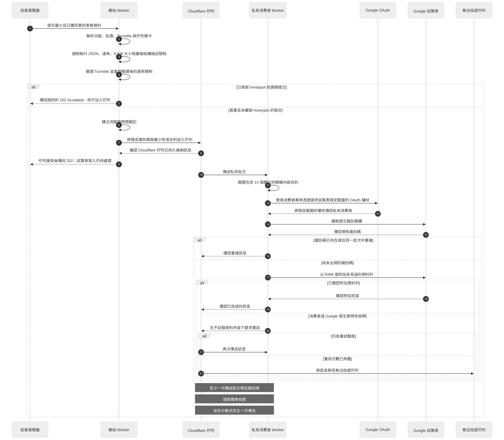

# Contact-to-Sheets consumer

[English](README.md) · [**繁體中文**](README.zh-Hant.md)

這個獨立 Cloudflare Worker 展示聯絡表格流程的私人部分。真實提交只在 Cloudflare Queue 接受 message 後回傳 `202 Accepted`；honeypot 收到相同 response，但不加入 Queue。consumer 會驗證準確 14 欄 message、取得只限 Sheets 的 Google OAuth token、讀取 A 欄既有 submission ID，再以 `valueInputOption=RAW` 把未見資料 append 到 `A:N`。

這樣可避免為首屆活動的小型流程另建通用應用程式資料庫，但並非完全沒有 persistence。Cloudflare Queue 非同步傳送 message，Google Sheets 是選定的工作目的地。



[查看 Mermaid 原始檔](../../docs/diagrams/queue-to-sheets-sequence.zh-Hant.mmd)。

## Trust boundary

只有這個 Worker 可以取得以下 secrets：

```text
GOOGLE_SERVICE_ACCOUNT_CREDENTIALS_JSON
GOOGLE_SHEET_ID=replace-with-approved-sheet-id
GOOGLE_SHEET_RANGE=Contacts!A:N
```

儲存庫不提供 credential JSON 示例。每個值應使用 Cloudflare secret mechanism 儲存，不可放入 browser code、website producer variables、logs、fixtures 或 committed environment files。

service account 只應獲准存取指定 Sheet。OAuth request 只使用 `https://www.googleapis.com/auth/spreadsheets` scope。

## Delivery semantics

Cloudflare Queues 採用 at-least-once delivery。consumer 會：

1. 拒絕不符合準確 14 欄 contract 的 message；
2. retry invalid message，讓 Wrangler `max_retries` 可把它移到 dead-letter Queue；
3. 合併同一 batch 內的 duplicate ID；
4. acknowledge 已存在於 Sheet A 欄的 ID；
5. 只以 `RAW` append 未見的 `A:N` rows；以及
6. append response 成功後才 acknowledge。

如果 append 已 commit 但 response timeout，message 會 retry；下一次讀取 A 欄後找到 stable ID，便可直接 acknowledge 而不再次 append。這是一般重試的 idempotent convergence，不是 distributed exactly-once guarantee。

`max_concurrency` 刻意設為 `1`。Cloudflare 一般建議開放 concurrency 以 autoscale，但本設計對同一 Sheet 使用 serial read-before-append。多個 concurrent consumers 可能在 ID read 與 append 之間競爭；高流量 workload 應使用可透過 transaction 保證 uniqueness 的 destination。

## 本機驗證

所有測試使用 synthetic values 及 local fetch doubles，不會呼叫 Google、Cloudflare、Turnstile 或真實 Sheet。

```sh
npm run contact-consumer:typegen
npm run contact-consumer:typegen:check
npm run contact-consumer:test
npm run contact-consumer:typecheck
npm run contact-consumer:dry-run
```

dry run 只在本機 bundle，不會 deploy。logs 只包括 event names、counts 及 upstream status，不包含 message bodies、IDs、names、contact details、tokens、Sheet identifiers、credential material 或 raw errors。

## 限制

- Sheet retention、withdrawal、access review、dead-letter recovery 及 monitoring 仍屬營運責任。
- read-before-append 不是 transaction，只適合這個小型 single-writer setup。
- 公開作品集預設關閉網站資料收集，亦不含 live resource identifier 或 credential。
